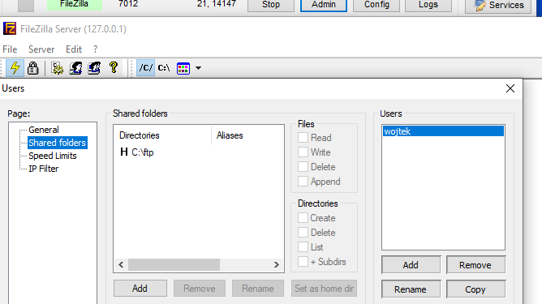
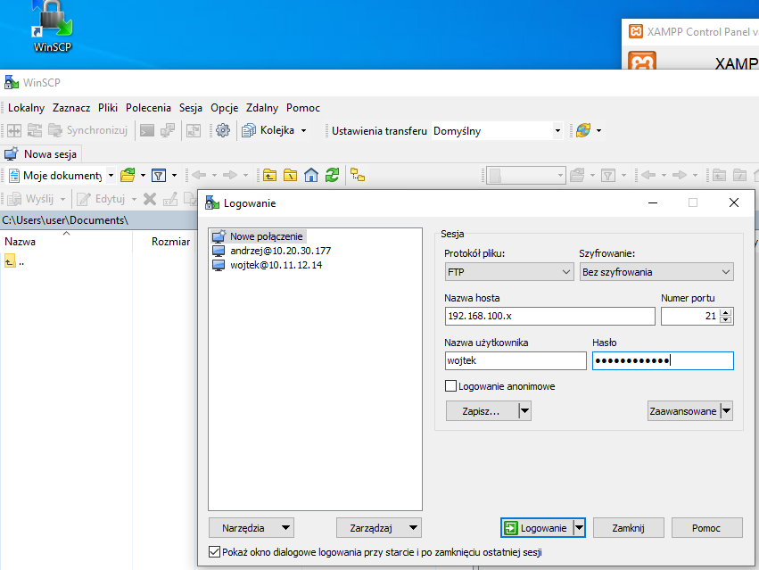
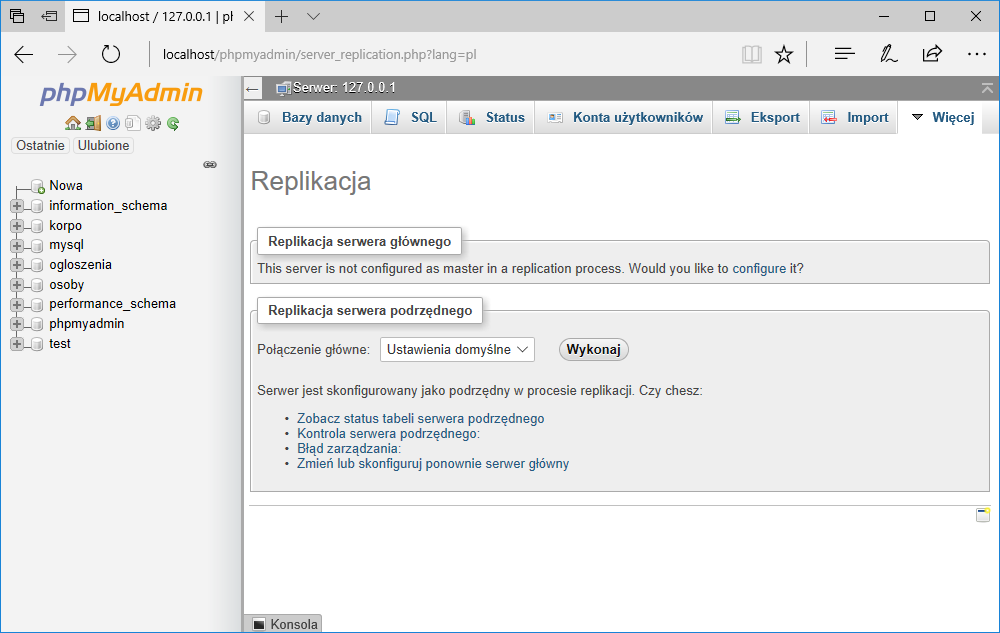
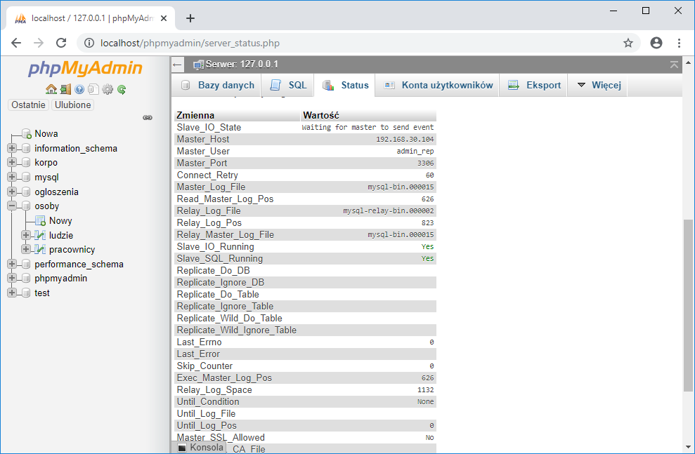
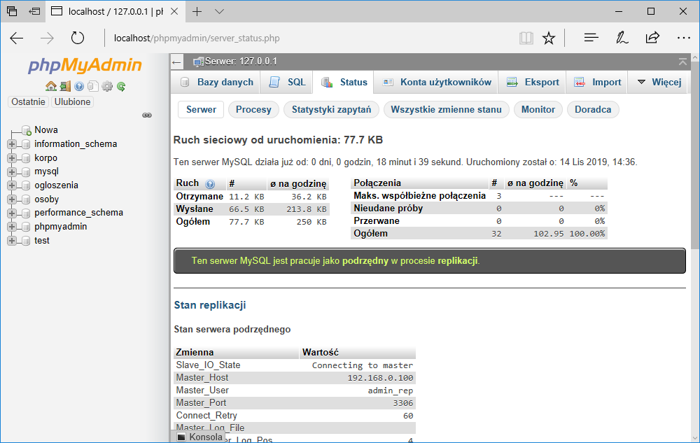
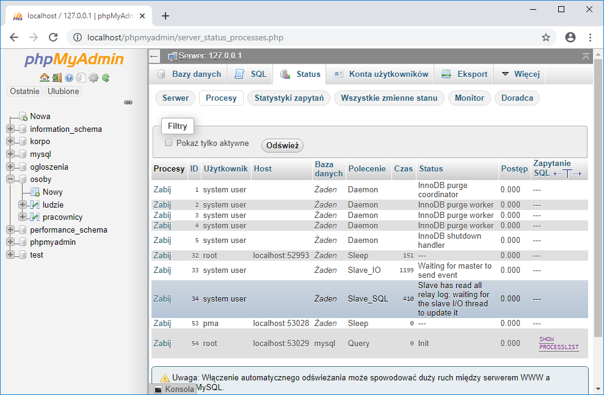
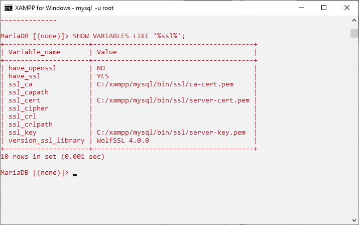
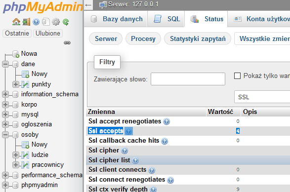
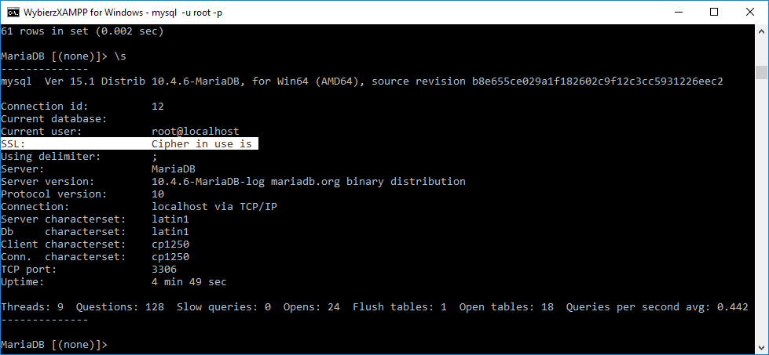
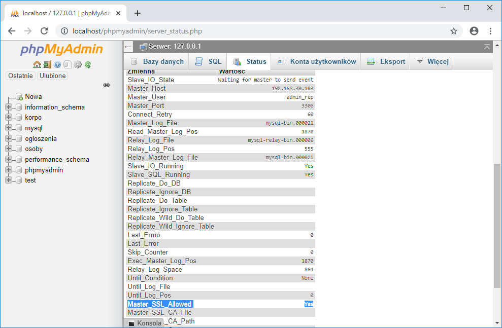

# Ćwiczenia 10 -- replikacja bazy

💡Uwaga: praca w parach na dwóch komputerach

1. Uruchomić Apache i MySql.

1. Zaimportuj 3,4 bazy danych z kopii zapasowej.

1. Jeśli replikacja działa, zakomentuj wpisy w pliku my.ini i
    zrestartuj MySql.

1. Z pomocą phpMyAdmin utwórz replikację serwera głównego (master).
    Zakładka replikacja dla 3 baz.

   

1. Zapisz ustawienia w pliku my.ini w sekcji [mysqld]:

   ```ini
    server-id=766
    log_bin=mysql-bin
    log_error=mysql-bin.err
    binlog_do_db=sklep
    binlog_do_db=korpo
    binlog_do_db=osoby
   ```

1. Stwórz konto o nazwie replik z uprawnieniem REPLICATION SLAVE.

1. Sprawdź w Shellu status serwera głównego:

   ```sql
   SHOW MASTER STATUS;
   ```

   

1. Wykonaj zapytanie:

   ```sql
   SELECT * FROM baza.tabela; 
   ```

   dla wybranej bazy i tabeli.

1. Wykonaj polecenie

   ```sql
   SHOW processlist;
   ```

1. Wykonaj polecenie

   ```sql
   SHOW SLAVE HOSTS;
   ```

1. Sprawdź w phpMyAdmin w zakładce STATUS procesy i stan serwera.

1. Wykonaj kopię zapasową 3 baz z opcją --master-data do pliku
   kopia.sql.
   Skopiuj plik na drugi komputer z pomocą serwera FTP
   zawartego w XAMPP.

   FilleZilla start i kliknij admin

   W nowym oknie dodaj Shared folders, np .: c:\ftp
   oraz konto użytkownika ftp, podaj swoje imię.

   

1. Na serwerze podrzędnym połącz się z pomocą WinScp i skopiuj plik backup.sql

   

1. Na drugim komputerze skonfiguruj serwer podrzędny.

   

   

1. Stan replikacji + procesy.

   

   

1. Odtwórz dane z pliku kopia.sql.

1. Otwórz plik my.ini

   ```ini
   server-id=2
   report-host='twoja_nazwa_serwera'
   ```

1. Uruchom Shella i sprawdź połączenie z serwerem głównym:

   ```bash
   ping 192.168.100.x 
   ```

   Sprawdź poprawność konta do replikacji:

   ```bash
   mysql -u replik -p -h 192.168.100.x 
   ```

1. Jeśli można się zalogować, to przełącz się na konto Root.

1. Wydaj komendę:

   ```sql
   CHANGE MASTER TO MASTER_HOST=<host>, MASTER_PORT=<port>,
   MASTER_USER=<user>, MASTER_PASSWORD=<password> ,
   MASTER_LOG_FILE = 'master_log_name', MASTER_LOG_POS = master_log_pos;
   ```

1. Jeśli polecenie wykona się poprawnie to

   ```sql
   START SLAVE
   ```

1. Jeśli polecenie wykona się poprawnie to

   ```sql
   SHOW SLAVE STATUS.
   ```

1. Sprawdź w phpMyAdmin w zakładce STATUS procesy i stan serwera.

1. Na serwerze głównym wykonaj polecenie

   ```sql
   SHOW SLAVE HOSTS;
   ```

1. Dodaj record na serwerze głównym i sprawdź czy pojawił się na
    serwerze slave.

1. Wykonaj na serwerze podrzędnym zapytanie:

   ```sql
   SELECT * FROM baza.tabela;
   ```

    dla wybranej bazy i tabeli

1. Sprawdź zawartość pliku master.info na serwerze slave.

1. Jeśli replikacja działa poprawnie, zmodyfikuj użytkownika replik
   i serwer master tak, aby można było replikować bazy
   za pomocą połączeń szyfrowanych SSL.

1. Generowanie certyfikatów dla serwera i stacji:

   ```bash
    openssl genrsa 2048 > ca-key.pem
    openssl req -new -x509 -nodes -days 730 -key ca-key.pem -out ca-cert.pem
    openssl req -newkey rsa:2048 -days 730 -nodes -keyout server-key.pem -out server-req.pem
    openssl rsa -in server-key.pem -out server-key.pem
    openssl x509 -req -in server-req.pem -days 730 -CA ca-cert.pem -CAkey ca-key.pem -set_serial 01 -out server-cert.pem
    openssl req -newkey rsa:2048 -days 730 -nodes -keyout client-key.pem -out client-req.pem
    openssl rsa -in client-key.pem -out client-key.pem
    openssl x509 -req -in client-req.pem -days 730 -CA ca-cert.pem -CAkey ca-key.pem -set_serial 01 -out client-cert.pem
    openssl verify -CAfile ca-cert.pem server-cert.pem client-cert.pem
   ```

1. SSL po stronie server master

   ```sql
   show variables like '%ssl%';
   ```

   

   
1. Założenie konta dla połączeń ssl:

   ```sql
   GRANT REPLICATION SLAVE ON *.* TO 'admin_rep'@'192.168.30.100' IDENTIFIED BY PASSWORD '*23AE809DDACAF96AF0FD78ED04B6A265E05AA257' REQUIRE SSL;
   ```

1. Sprawdzenie szyfrowanego połączenia na windows , serwer podrzędny:

   
1. Sprawdzenie konfiguracji na serwerze podrzędnym:

   

1. KONIEC.🔚
