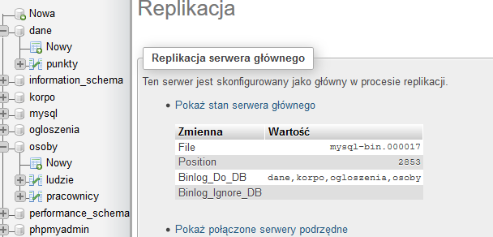
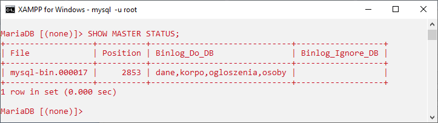

Ćwiczenia 10 -- replikacja bazy
Uwaga: praca w parach na dwóch komputerach
1.  Uruchomić Apache i MySql.
2.  Zaimportuj 3,4 bazy danych z kopii zapasowej.
3.  Jeśli replikacja działa, zakomentuj wpisy w pliku my.ini i
    zrestartuj MySql.
4.  Z pomocą phpMyAdmin utwórz replikację serwera głównego (master).
    Zakładka replikacja dla 3 baz.

5.  Zapisz ustawienia w pliku my.ini w sekcji \[mysqld\]:
server-id=766
log_bin=mysql-bin
log_error=mysql-bin.err
binlog_do_db=sklep
binlog_do_db=korpo
binlog_do_db=osoby
6.  Stwórz konto o nazwie replik z uprawnieniem REPLICATION SLAVE.
7.  Sprawdź w Shellu status serwera głównego: SHOW MASTER STATUS;

8.  Wykonaj zapytanie SELECT \* FROM baza.tabela; (dla wybranej bazy i
    tabeli)
9.  Wykonaj polecenie SHOW processlist;
10. Wykonaj polecenie SHOW SLAVE HOSTS;
11. Sprawdź w phpMyAdmin w zakładce STATUS procesy i stan serwera.
12. Wykonaj kopię zapasową 3 baz z opcją --master-data do pliku
    kopia.sql. Skopiuj plik na drugi komputer.
13. Na drugim komputerze skonfiguruj serwer podrzędny (slave).
14. Odtwórz dane z pliku kopia.sql.
15. Otwórz plik my.ini
server-id=2
report-host='twoja_nazwa_serwera'
16. Uruchom Shella i sprawdź połączenie z serwerem głównym:
ping ip
mysql --u replik -p
17. Jeśli można się zalogować, to przełącz się na konto Root.
18. Wydaj komendę:
CHANGE MASTER TO MASTER_HOST=\<host\>, MASTER_PORT=\<port\>,
MASTER_USER=\<user\>, MASTER_PASSWORD=\<password\> ,
MASTER_LOG_FILE = \'master_log_name\', MASTER_LOG_POS = master_log_pos;
19. Jeśli polecenie wykona się poprawnie to START SLAVE.
20. Jeśli polecenie wykona się poprawnie to SHOW SLAVE STATUS.
21. Sprawdź w phpMyAdmin w zakładce STATUS procesy i stan serwera.
22. Na serwerze głównym wykonaj polecenie SHOW SLAVE HOSTS;
23. Dodaj record na serwerze głównym i sprawdź czy pojawił się na
    serwerze slave.
24. Wykonaj na serwerze podrzędnym zapytanie SELECT \* FROM baza.tabela;
    (dla wybranej bazy i tabeli)
25. Sprawdź zawartość pliku master.info na serwerze slave.
26. Zmodyfikuj użytkownika replik i serwer master tak, aby można było
    replikować bazy za pomocą połączeń szyfrowanych SSL.
