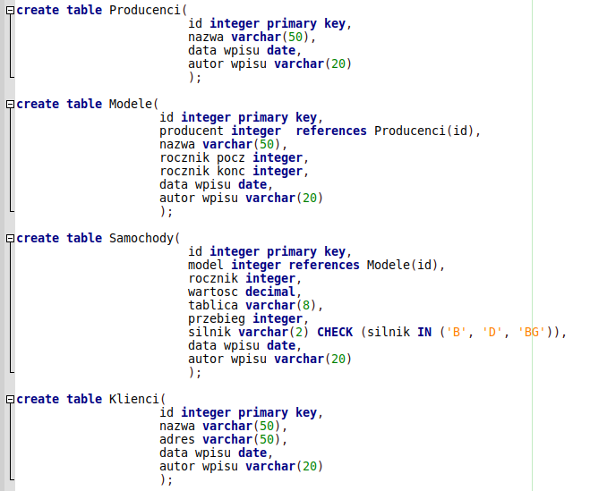
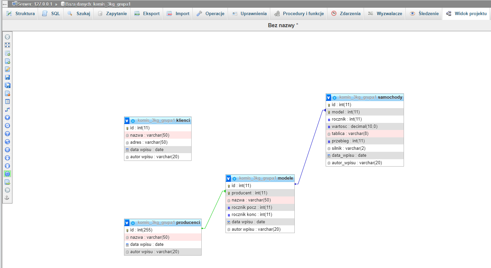
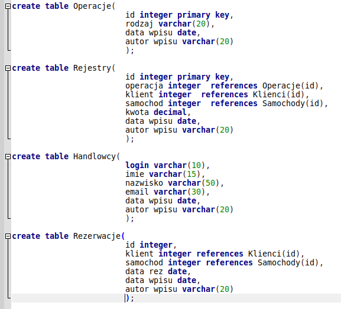

Ćwiczenia 1 -- tworzenie tabel i baz danych
1.  Zalogować się na swoje konto
2.  Skopiuj katalog xampp/mysql do Dokumenty
3.  Uruchomić Apache i MySql.
4.  Otworzyć dokumentację dla MariaDB 10... i MySql 8...
5.  Utworzyć bazę o nazwie komis\_2X_grupaY, za X wstaw klasę za Y numer
    swojej grupy.
6.  Dodać użytkownika o nazwie twoje_imię
7.  Nadaj mu wszystkie uprawnienia do nowo założonej bazy
    komis_2X_grupaY.
8.  Utwórz tabele i relacje ( widok relacji na drugiej stronie):

9.  Dla CHECK użyj ALTER TABLE samochody modify \...
10. Wprowadzić relacje w widoku projektu lub zaznaczyć tabelę →
    Struktura → widok relacji
11. Ewentualnie dodaj relacje poprzez polecenie sql, np.:
    ALTER TABLE rejestry ADD FOREIGN KEY operacja REFERENCES
    operacje(id);
12. Wykonać eksport bazy do pliku z rozszerzeniem sql. Sprawdzić
    zawartość kopii. Wysłać plik do chmury.
13. Widok relacji:
    
14. Utwórz kolejne tabele:

15. Wykonać eksport bazy do pliku z rozszerzeniem sql. Zaznacz: 'Dodaj
    oświadczenie
    CREATE DATABASE / USE.
16. Sprawdzić zawartość kopii. Wysłać plik do chmury.
17. Usunąć bazę z poziomu phpMyAdmin.
18. **Od tego momentu pracuj w shellu!!!**
19. Zapisz utworzone tabele do formatu html i xml !!!
20. Sprawdzić logowanie z katalogu c:/xampp/mysql/bin ( **mysql --u
    konto --p** )
21. Zapisuj komendy do pliku tekstowego o nazwie
    twoje_imię_nazwisko.txt. (\\T plik ). Na koniec zajęć skopiuj ten
    plik do zasobu na Teams.
22. Wydać komendę SHOW DATABASES;
23. Utworzyć bazę o nazwie komis_2X_grupaY, za x wstaw numer swojej
    grupy.
24. Podłączyć się do bazy *use komis_2X_grupaY*
25. Utworzyć tabelę Producenci.
26. Wydać komendę SHOW TABLES;
27. Wydać komendę SHOW FIELDS FROM Producenci.
28. Wydać komendę DESCRIBE Producenci.
29. Następnie utwórz pozostałe powyższe tabele.
30. Pamiętaj o zachowaniu relacji. Możesz je sprawdzić: SHOW CREATE
    TABLE nazwa_tabeli;
31. Wykonać eksport bazy do pliku z rozszerzeniem sql. Zaznacz: 'Dodaj
    oświadczenie CREATE DATABASE / USE.
32. Zapisz utworzone tabele do formatu html i xml
33. Zapisz pliki xml i html na Teams.
34. Zatrzymać xamppa i usługi Apache i MySql, zrestartować komputer i
    sprawdzić czy działa środowisko i usługi: phpMyAdmin, Apache i
    MySql.
