Ćwiczenia 2 -- tworzenie kont, ról i nadawanie uprawnień
1.  Utwórz kopię katalogu c:\\xampp\\mysql do folderu dokumenty.
2.  Uruchomić Apache i MySql.
3.  Otworzyć dokumentację dla MariaDB 1x..., np.:
> <https://mariadb.com/docs/server/reference/sql-statements/account-management-sql-statements/create-user>
>
> <https://mariadb.com/docs/server/reference/sql-statements/account-management-sql-statements/drop-user>
>
> <https://mariadb.com/docs/server/reference/sql-statements/account-management-sql-statements/alter-user>
>
> Komendy show:
<https://mariadb.com/docs/server/reference/sql-statements/administrative-sql-statements/show/show-create-user>
<https://mariadb.com/docs/server/reference/sql-statements/administrative-sql-statements/show/show-grants>
Dodatkowe:
<https://mariadb.com/kb/en/authentication-plugin-mysql_native_password/>
<https://mariadb.com/kb/en/grant/>
<https://mariadb.com/kb/en/revoke/>
<https://mariadb.com/kb/en/show-privileges/>
4.  Dodać dwóch użytkowników w phpMyAdmin o nazwach iwonaXYZ i
    blazejXYZ,
gdzie XYZ to kod klasy i grupy.
**Dla konta IwonaXYZ:**
a)  Nazwa hosta: localhost
b)  Wtyczka uwierzytelniająca: natywne uwierzytelnianie MySQL
c)  Wygeneruj hasło
d)  Utwórz bazę danych z taką samą nazwą i przyznaj wszystkie
    uprawnienia
e)  Globalne uprawnienia:
- Dane: selekt i update
- Struktura: create i alter
- Administracja: replication slave
- Ograniczenie zasobów: MAX QUERIES PER HOUR na 10
f)  SSL: REQUIRE
    NONE
> **Dla konta blazejXYZ:**
g)  Nazwa hosta: dowolny host
h)  Wtyczka uwierzytelniająca: natywne uwierzytelnianie MySQL
i)  Hasło: brak hasła
j)  Utwórz bazę danych z taką samą nazwą i przyznaj wszystkie
    uprawnienia
k)  Globalne uprawnienia:
- Dane: update
- Struktura: index i show view
- Administracja: GRANT i RELOAD
- Ograniczenie zasobów: MAX USER_CONNECTIONS na 5
l)  SSL: REQUIRE SSL
<!-- -->
5.  Dodać obu użytkowników do nowo założonej grupy o nazwie:
    adminiwwwXYZ
6.  Utworzyć bazę o nazwie wspolnaXYZ z dwiema tabelami test i test2. Do
    test dodać 2 rekordy danych.
7.  Nadać obu kontom uprawnienia do nowo założonej bazy.
8.  Od tego punktu pracujemy w Shellu!!! Sprawdzić logowanie z katalogu
    c:/xampp/mysql/bin
( **mysql --u konto --p** ) dla obu kont: iwonaXYZ i blazejXYZ
9.  Podłączyć się do baz: iwonaXYZ, blazejXYZ i wspolnaXYZ.
10. Wylogować się.
11. Przeloguj się na konto root .
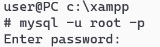

12. Usuń konta iwonaXYZ, blazejXYZ. ( DROP user ...).
13. Stwórz konta iwonaXYZ, blazejXYZ podaj hasło wprost, za pomocą
    CREATE USER user@host identified by ...
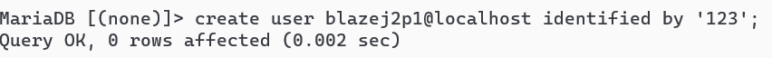
14. Utwórz konto dla Mateusza, tak, aby się logował bez hasła.(
    CREATE [USER](http://localhost/phpmyadmin/url.php?url=https://dev.mysql.com/doc/refman/8.0/en/information-functions.html%23function_user) \'mateusz\'@\'localhost\')
15. Utwórz konto dla Tomasza z użycie pluginu mysql_native_password.(
    CREATE [USER](http://localhost/phpmyadmin/url.php?url=https://dev.mysql.com/doc/refman/8.0/en/information-functions.html%23function_user) \'tomasz\'@\'localhost\'
    IDENTIFIED VIA mysql_native_password USING \'\*\*\*\';)
16. Utwórz konto o nazwie monika z hasłem 'prostehaslo' w postaci
    zahaszowanej ( CREATE USER ... oraz SELECT PASSWORD('tajnehasło') --
    postać hash hasła)
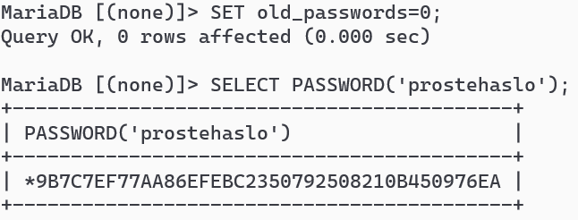
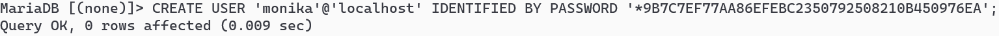
17. Sprawdź istniejące konta na serwerze:
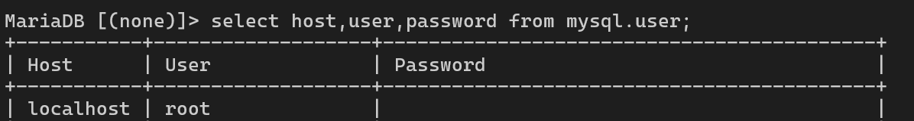
18. Zmień hasło dla użytkownika monika:
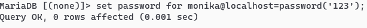
19. Zalogować się na konto monika.
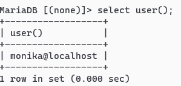
20. Zmodyfikować konto z poziomu konta monika dla iwonaXYZ dwa razy (
    alter user ... )
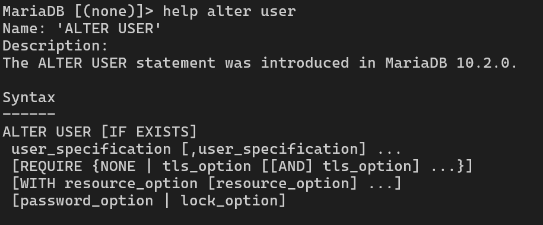
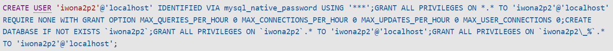
Na przykład, zmienić hasło:
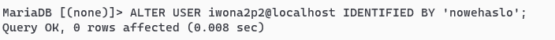
21. Zmienić, któreś z pozycji dla Resource Limit Options, dla każdego z
    kont, pojedynczo lub kilka:
Pomocniczo:
MAX_QUERIES_PER_HOUR - maksymalna liczba zapytań na godzinę
MAX_UPDATES_PER_HOUR - maksymalna liczba aktualizacji na godzinę
MAX_CONNECTIONS_PER_HOUR - maksymalna liczba połączeń na godzinę
MAX_USER_CONNECTIONS - maksymalna liczba jednoczesnych połączeń
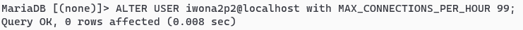
Sprawdzenie:
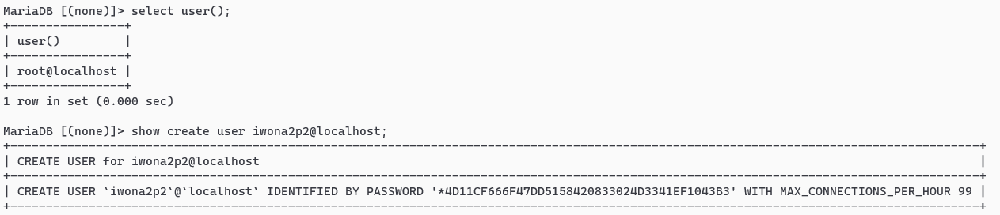
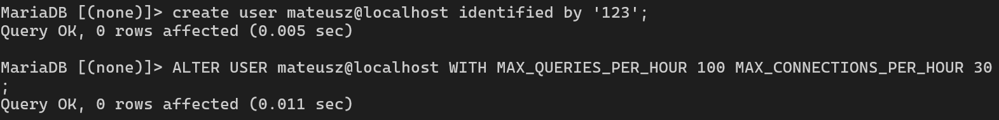
22. Sprawdzenie konta mateusz:
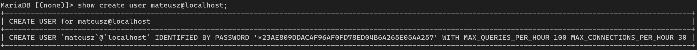
23. Zmienić, któreś z pozycji dla , dla każdego z kont, pojedynczo lub
    kilka:
Pomocniczo:
> SSL - wymaga połączenia SSL
>
> X509 - wymaga certyfikatu X509
>
> CIPHER - wymaga określonego szyfru, trzeba go podać ''
>
> NONE - brak wymagań bezpieczeństwa
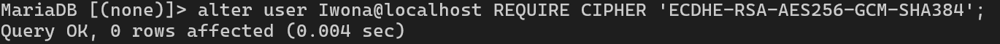
24. Sprawdzenie konta Iwona:
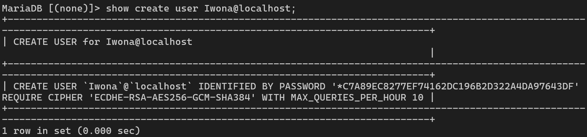
25. Prostszy przykład dla konta Tomasz:
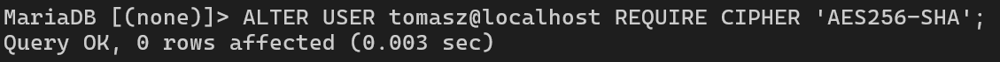
26. Dla moniki ustaw certyfikat
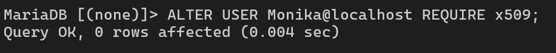
27. Dla Mateusza ustaw ssl:

28. Sprawdź wszystkie konta jednocześnie:
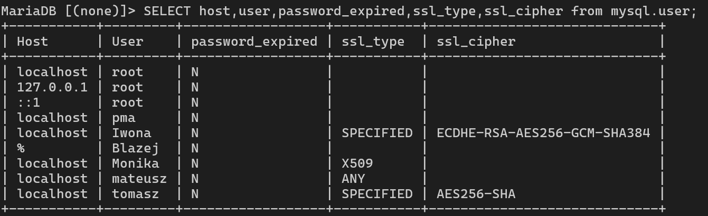
29. Ustawić wygasanie/zmianę hasła za dany interwał ( 200 dni, ...,
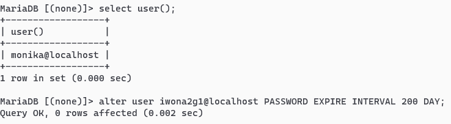
lub hasło nigdy nie wygasa NEVER.
30. Sprawdzić ( SHOW CREATE USER 'iwonaXYZ'@'localhost';)
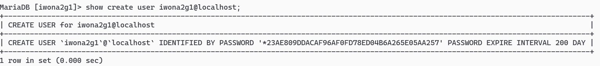
31. Ustaw wygasanie hasła na 180 dni za pomocą wartości domyślnej w
    pliku my.ini dla zmiennej default_password_lifetime
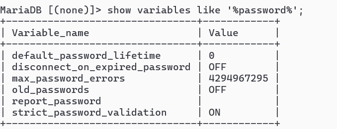
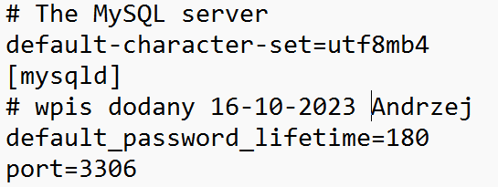
32. Zmiana wymuszona hasła dla root:
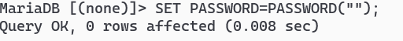
33. Sprawdzenie wartości zmiennej:
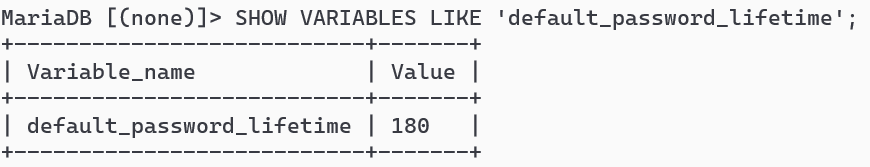
34. Wymusić zmianę hasła przy następnym logowaniu (PASSWORD EXPIRE) z
    poziomu konta monika.
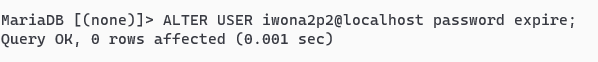
Zalogować się na konto iwonaXYZ w drugim Shellu i wydać komendę SHOW
DATABASES;
Następnie ustawić nowe hasło:
SET PASSWORD=PASSWORD('nowehasło')
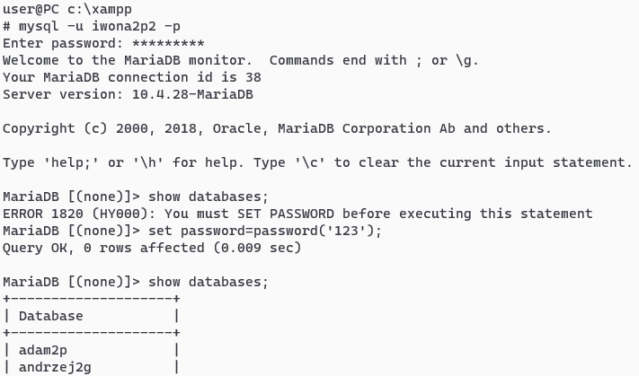
35. Zablokować konto blazejXYZ (Alter user 'blazejXYZ'@'localhost'
    account lock).
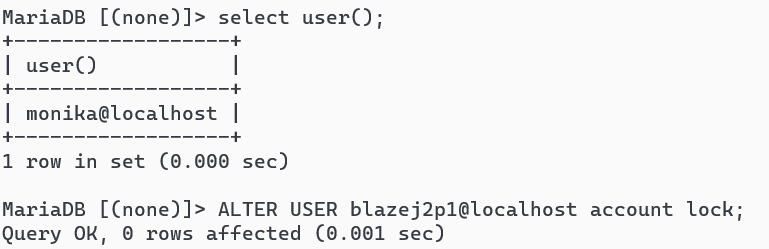
36. Sprawdź skuteczność blokady. ( SHOW create user
    'blazejXYZ'@'localhost';)
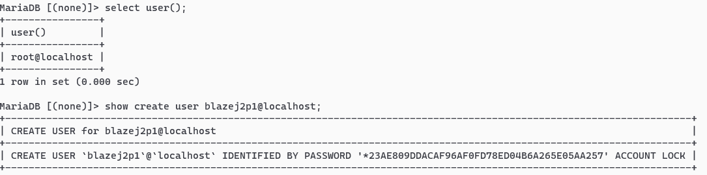
37. Zalogować się na konto blazejXYZ w trzecim Shellu.
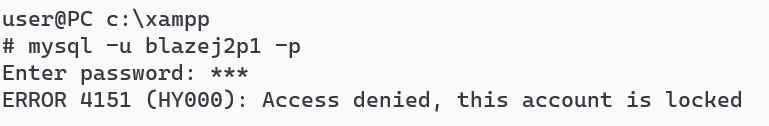
38. Odblokować konto blazejXYZ.
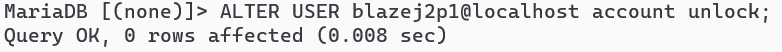
39. Sprawdź skuteczność odblokowania komendą i poprzez zalogowanie:
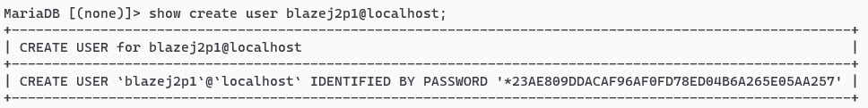
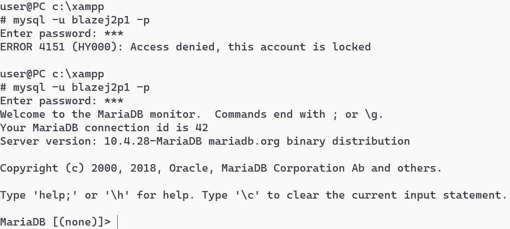
40. Inne przykłady:
PASSWORD EXPIRE - wymusza zmianę hasła czy wygasanie podajemy przez
INTERVAL ... DAY
ACCOUNT LOCK/UNLOCK - blokada/odblokowanie konta
41. Sprawdź uprawnienia dla kont odpowiednimi komendami:
Inny sposób:
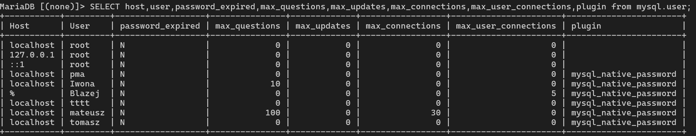
Oraz
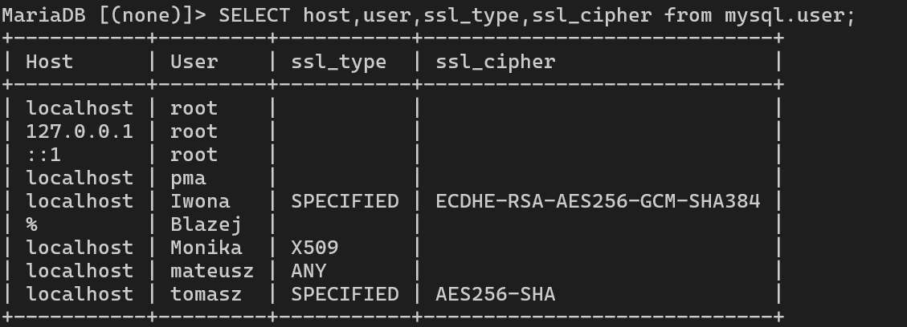
42. 
    Usunąć konta monika, iwonaXYZ i
    blazejXYZ oraz marek o ile istnieją.( DROP USER ...
43. Utwórz kopię katalogu mysql.
44. Usunąć założone bazy. ( DROP DATABASE ... )
> 
45. Utwórz kopię katalogu mysql.
46. Zatrzymać usługi Apache i MySql.
47. KONIEC
