Ćwiczenia 3 -- nadawanie uprawnień, role
1.  Utwórz kopię katalogu c:\\xampp\\mysql do folderu dokumenty.
2.  Uruchomić Apache i MySql.
3.  Otworzyć dokumentację dla MariaDB 10..., np.:
<https://mariadb.com/kb/en/authentication-plugin-mysql_native_password/>
<https://mariadb.com/kb/en/grant/>
<https://mariadb.com/kb/en/revoke/>
<https://mariadb.com/kb/en/show-privileges/>
4.  Od tego punktu pracujemy w Shellu!!! Dodać trzech użytkowników
    monika blazejXYZ i iwonaXYZ.
5.  Utwórz odpowiednie bazy dla użytkowników, czyli monika, Henryk i
    Ryszard.
6.  Utworzyć bazę o nazwie wspolnaXYZ z dwiema tabelami test i test2. Do
    test dodać 2 rekordy danych.
7.  Nadać obu kontom uprawnienia do nowo założonej bazy.
8.  Sprawdzić logowanie ( **mysql --u konto --p** ) dla kont: monika,
    blazejXYZ i iwonaXYZ.
9.  Podłączyć się do baz: monika, blazejXYZ, iwonaXYZ i wspolnaXYZ.( use
    baza)
10. Wylogować się z wszystkich kont.
11. Przeloguj się na konto root .

12. Sprawdź istniejące konta na serwerze:

13. Sprawdź listę dostępnych uprawnień: ( SHOW privileges; )

14. Nadać uprawnienia dla wszystkich kont ( GRANT lista_uprawnień on
    baza.tabela to user@host wszystkie, lub tylko wybrane)
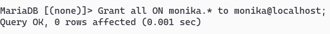
15. Sprawdź czy nadałeś/aś uprawnienia poprawnie.

16. Odśwież uprawnienia:

17. Odebrać **wybrane** uprawnienia użytkownikom blazejXYZ, iwonaXYZ i
    monika (REVOKE ...
np.: REVOKE grant option, select ON baza.\* FROM user@localhost; )

18. Wykonać instrukcje **kilka razy** GRANT, REVOKE zmieniając za każdym
    razem parametry, sprawdzać uprawnienia za każdym razem.
( np. SHOW GRANTS FOR BlazejXYZ@localhost; )

19. Zaimportuj bazę sklep z pliku na teams lub stwórz ją z tabelą
    towary.
20. Z pomocą pliku utworzyć konta i nadać uprawnienia, utworz plik
    dwa_konta_grant.sql:
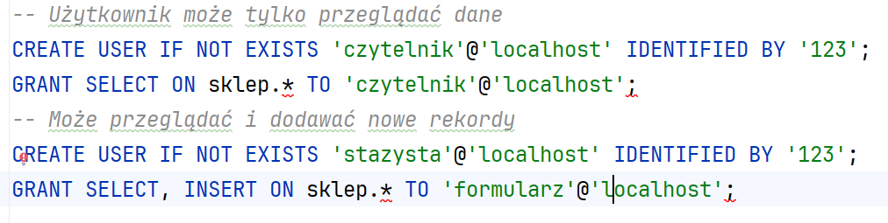
Wykonywalność poleceń możesz sprawdzić w DataGrip:
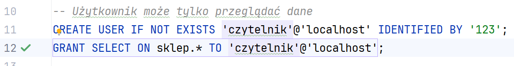
21. Wstaw komendy z pliku, a następnie sprawdź uprawnienia nowo
    powstałym kontom:
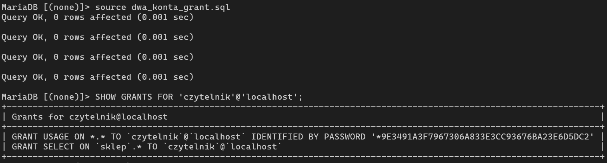
22. Utwórz konto redaktor, które może przeglądać, dodawać i modyfikować
    dane:
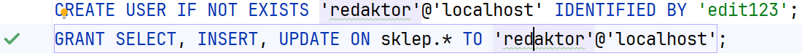
23. Sprawdzenie uprawnień:
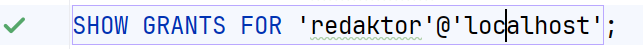
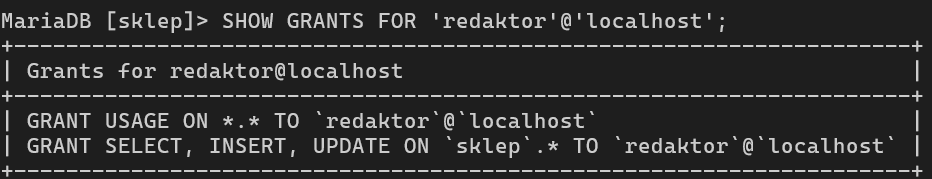
24. To samo w DataGrip:
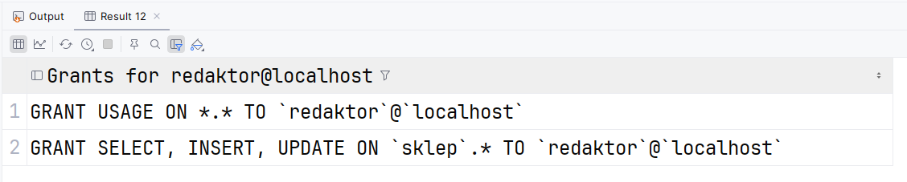
25. Utwórz użytkownika redaktor_glowny, który ma pełną kontrolę nad
    danymi:
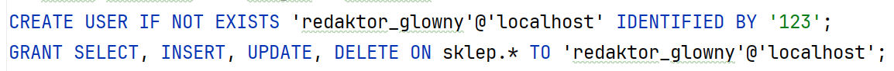
26. Sprawdzenie uprawnień:
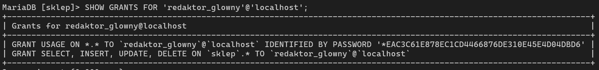
27. Utwórz konto programisty, które może to co redaktor główny plus
    możliwość wykonywania procedur i funkcji:
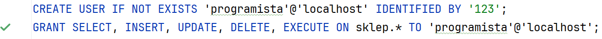
28. Sprawdzenie uprawnień:
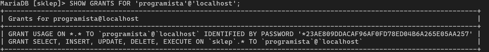
29. Sprawdź czy programista może wykonywać procedury i funkcje:
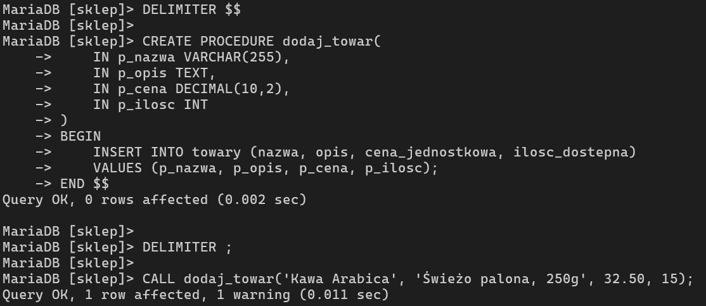
30. Dla funkcji:
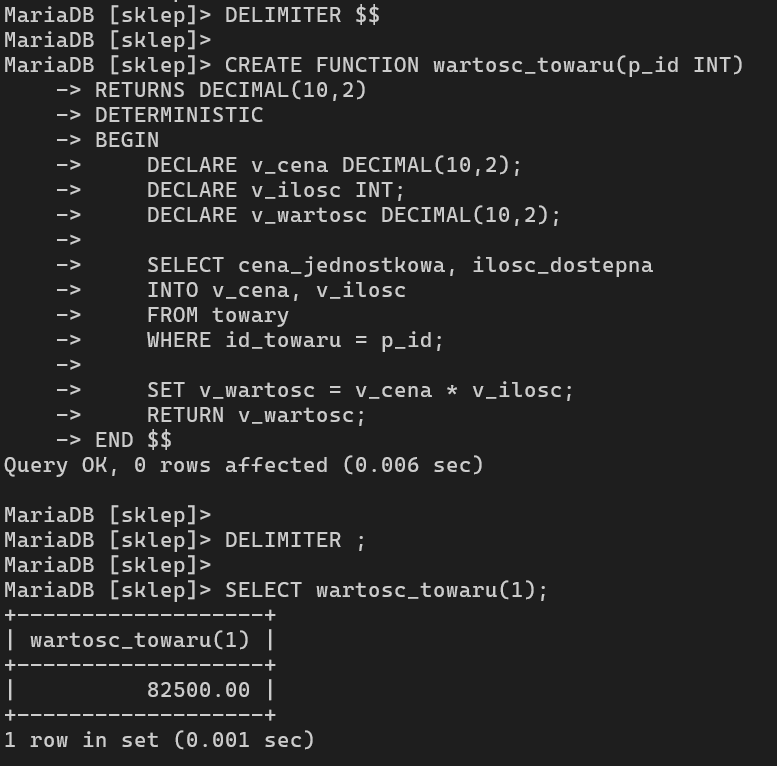
31.
32. Utwórz konto developer, które może tworzyć tabele tymczasowe w sesji
    i manipulować danymi
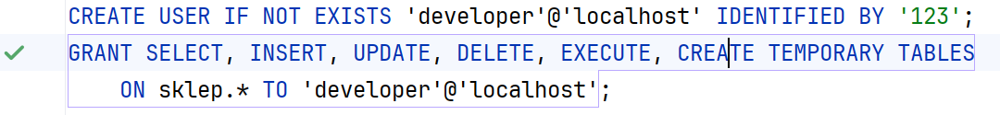
33. Sprawdzenie uprawnień:
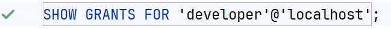
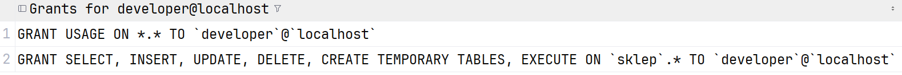
34. Utwórz konto manager, które ma pełną kontrolę nad danymi i strukturą
    tabel:
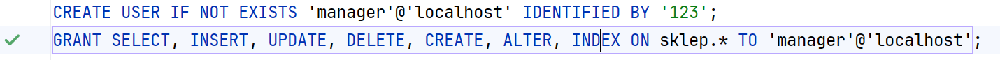
35. Sprawdzenie uprawnień:
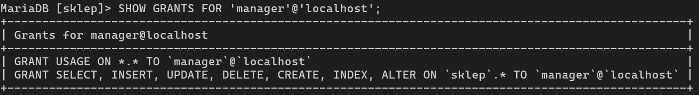
36. Utwórz konto admin, które ma pełny dostęp do wszystkich baz i
    serwera
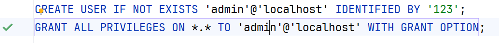
37. Sprawdzenie uprawnień:
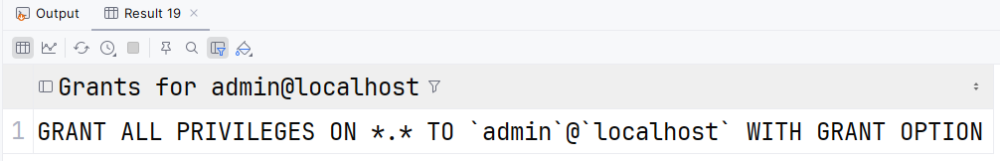
38. Utwórz konto audytor, które może przeglądać wszystkie dane i
    definicje, ale nie zmienia ich:
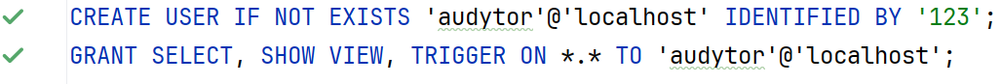
39. Sprawdzenie uprawnień:
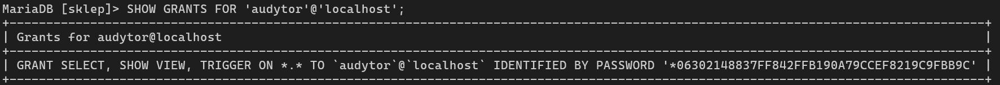
40. 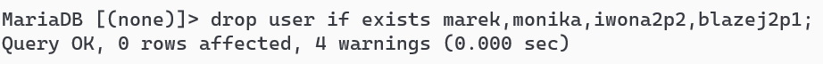
    Usunąć konta monika, blazejXYZ i
    iwonaXYZ oraz marek o ile istnieją.( DROP USER ...
41. Usunąć założone bazy. ( DROP DATABASE ... )
> 
42. Utwórz kopię katalogu mysql.
43. Zatrzymać usługi Apache i MySql.
44. KONIEC
