Ćwiczenia 3 -- nadawanie uprawnień, role
1.  Utwórz kopię katalogu c:\\xampp\\mysql do folderu dokumenty.
2.  Uruchomić Apache i MySql.
3.  Otworzyć dokumentację dla MariaDB 10..., np.:
<https://mariadb.com/kb/en/authentication-plugin-mysql_native_password/>
<https://mariadb.com/kb/en/create-role/>
<https://mariadb.com/kb/en/grant/>
<https://mariadb.com/kb/en/revoke/>
<https://mariadb.com/kb/en/show-privileges/>
4.  Od tego punktu pracujemy w Shellu!!! Dodać trzech użytkowników
    monika blazejXYZ i iwonaXYZ.
5.  Utwórz odpowiednie bazy dla użytkowników, czyli monika, Henryk i
    Ryszard.
6.  Utworzyć bazę o nazwie wspolnaXYZ z dwiema tabelami test i test2. Do
    test dodać 2 rekordy danych.
7.  Nadać obu kontom uprawnienia do nowo założonej bazy.
8.  Sprawdzić logowanie ( **mysql --u konto --p** ) dla kont: monika,
    blazejXYZ i iwonaXYZ.
9.  Podłączyć się do baz: monika, blazejXYZ, iwonaXYZ i wspolnaXYZ.( use
    baza)
10. Wylogować się z wszystkich kont.
11. Przeloguj się na konto root .

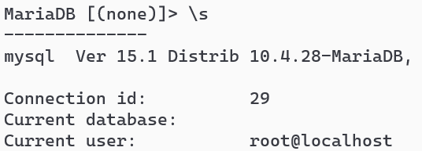
12. Sprawdź istniejące konta na serwerze:

13. Sprawdź listę dostępnych uprawnień: ( SHOW privileges; )
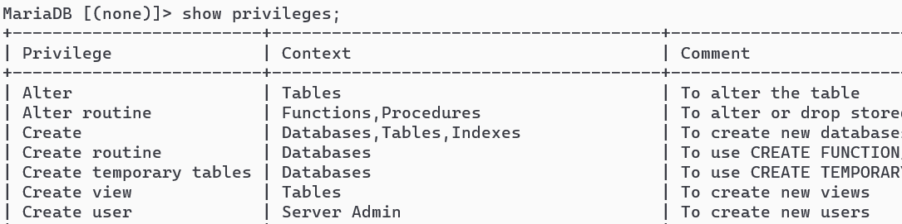
14. Nadać uprawnienia dla wszystkich kont ( GRANT lista_uprawnień on
    baza.tabela to user@host wszystkie, lub tylko wybrane)

15. Sprawdź czy nadałeś/aś uprawnienia poprawnie.
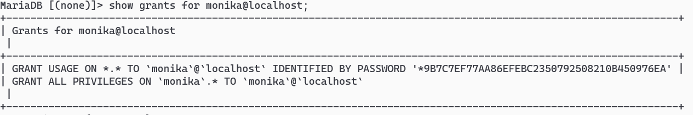
16. Odśwież uprawnienia:

17. Odebrać **wybrane** uprawnienia użytkownikom blazejXYZ, iwonaXYZ i
    monika (REVOKE ...
np.: REVOKE grant option, select ON baza.\* FROM user@localhost; )

18. Wykonać instrukcje **kilka razy** GRANT, REVOKE zmieniając za każdym
    razem parametry, sprawdzać uprawnienia za każdym razem.
( np. SHOW GRANTS FOR BlazejXYZ@localhost; )
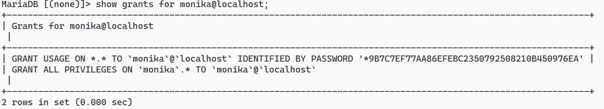
Część 3 -- Tworzenie ról
19. 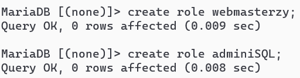
    Utwórz rolę webmasterzy i adminiSQL.
20. Nadaj uprawnienie SELECT dla webmasterów, a insert, update, delete
    dla adminiSQL.
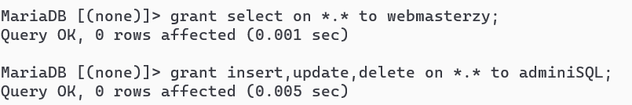
21. Z poziomu konta monika przypisz się do roli webmaster:
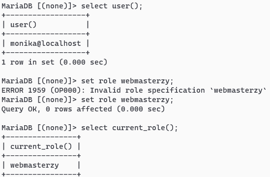
Wymagana modyfikacja WITH ADMIN:
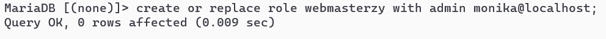
22. Sprawdź uprawnienia dla moniki:
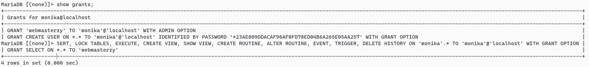
23. Sprawdź nadane uprawnienia dla ról:
> 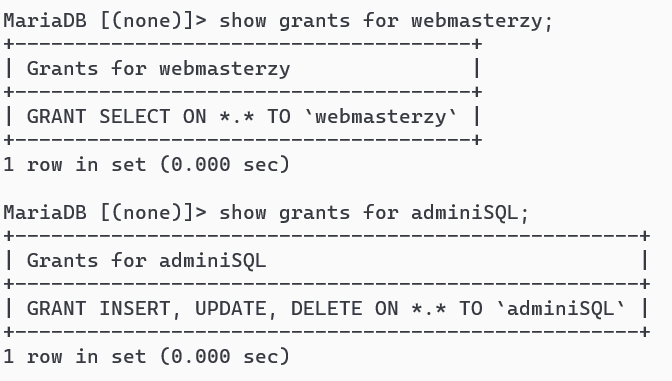
24. Przypisz użytkowników blazejXYZ i iwonaXYZ do tych ról.
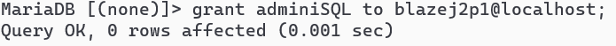
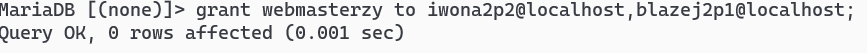
25. Sprawdź uprawnienia dla kont odpowiednimi komendami:
Dla Błażeja:
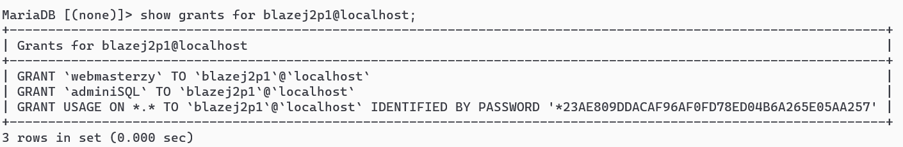
Dla Iwony:
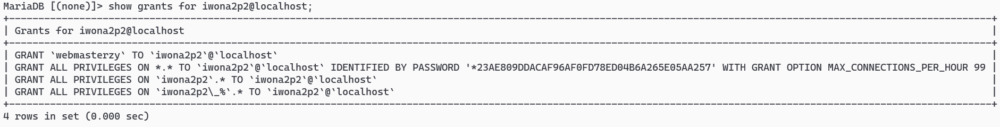
26. Ustaw domyślną rolę dla Moniki na programiści;
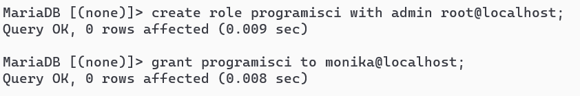
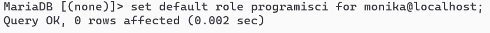
Sprawdzenie:
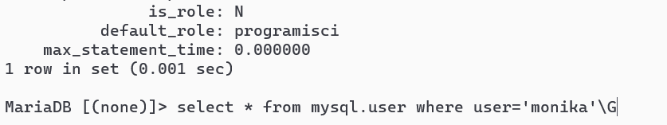
27. Zmodyfikuj obie role i sprawdź uprawnienia odpowiednimi komendami.
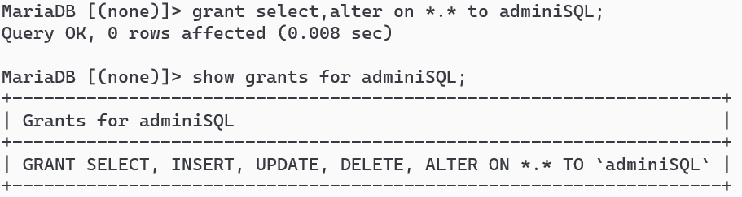
GRANT:
> 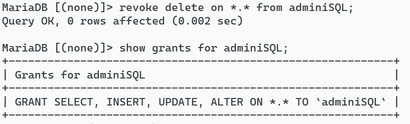
28. Dodaj rolę programiści do roli adminiSQL;
> 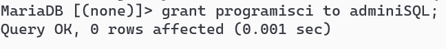
29. Sprawdź uprawnienia dla adminiSQL:
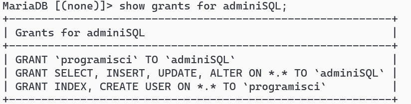
30. Zdejmij role użytkownikom.
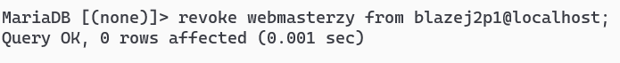
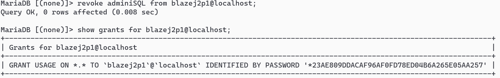
31. Wyświetl wszystkie role i konta:
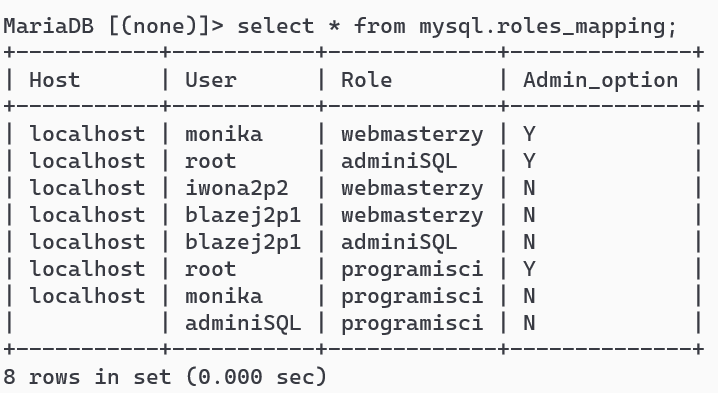
32. Ustaw bieżącą rolę dla Iwony na programiści, a następnie na none:
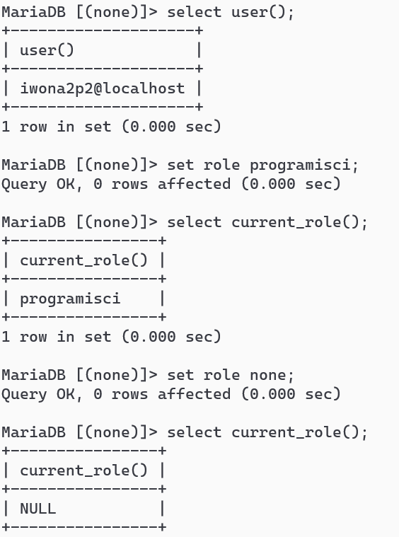
33. Usuń role. ( DROP ROLE ...)
> 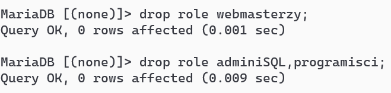
34. 
    Usunąć konta monika, blazejXYZ i
    iwonaXYZ oraz marek o ile istnieją.( DROP USER ...
35. Usunąć założone bazy. ( DROP DATABASE ... )
> 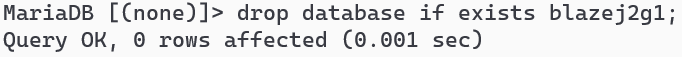
36. Utwórz kopię katalogu mysql.
37. Zatrzymać usługi Apache i MySql.
38. KONIEC
