# Ćwiczenia 5 - kopie zapasowe

1.  Stwórz dwie bazy w phpMyAdmin z dwiema tabelami, po 4 kolumny, 2
    wiersze danych.
2.  W shellu utwórz trzecią bazę danych o nazwie biblioteka z jedną
    tabelą o nazwie książki o strukturze jak poniżej. Wypełnij ją danymi
    (minimum 3 rekordy) za pomocą instrukcji `INSERT INTO` ....

 | Nazwa pola    | Typ danych     | Wartość | Klucz       | Inne             |
 |------------|----------------|---------|-------------|------------------|
 |  id       |         Int(11)    |         | PRIMARY KEY | AUTO_INCREMENT   |
 | autor     |       TEXT         |     NOT NULL    |             NOT NULL |
 | cena       |      float        |                 |       | długość 10 do 2 miejsc po przecinku|
  | data_sprzedazy |  DATE         |                |          |     rrrr-MM-dd |
  |tytul          |  VARCHAR       |    NOT NULL    |         |     długość 90 |

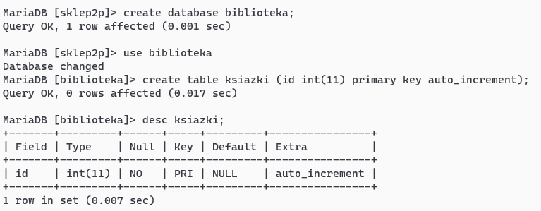
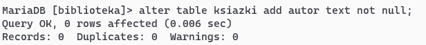
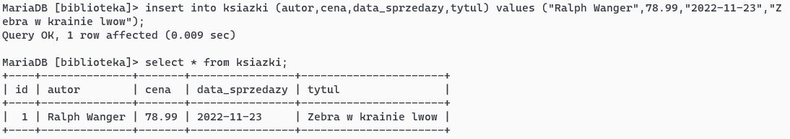

3.  Zaimportuj z poziomy phpMyAdmin czwartą bazę udostępnioną z linux
    lub teams o nazwie _kopia.sql_.
4.  Nadać uprawnienia do powyższych baz dla wybranych użytkowników.(po
    punkcie 5 sprawdzić, czy w plikach kopii znajdują się instrukcje
    `GRANT`)
5.  Wykonaj eksport baz danych:

a)  Jedną wyeksportuj metodą szybko do formatu .**XML**  
b)  Bazę danych z jedną tabelą metodą dostosuj do formatu .**SQL** i
    zaznacz opcję \"dodaj oświadczenie create database /use\"  
c)  Trzecią z wiersza poleceń za pomocą
    **mysqldump, mariadb-dump**  
   ( porównaj wielkości kopii tworzonych opcjami: 
   - c, i ,v, l, a, x oraz z opcjami skip\--...)

 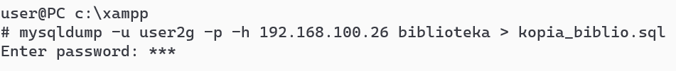
 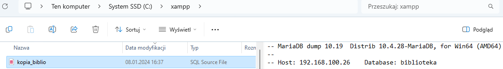

d)  Czwartą wyeksportuj do formatu **JSON** z kompresją zip lub gz.  
e)  Inna kopia  

6.  Sprawdź zawartość kopii zapasowych w eksploratorze, załącz okienko
    podglądu.  


7.  Wyeksportuj wybraną tabelę w shellu z użyciem SELECT kolumny from
    *table* `INTO OUTFILE` *plik*.

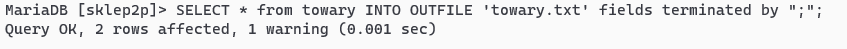
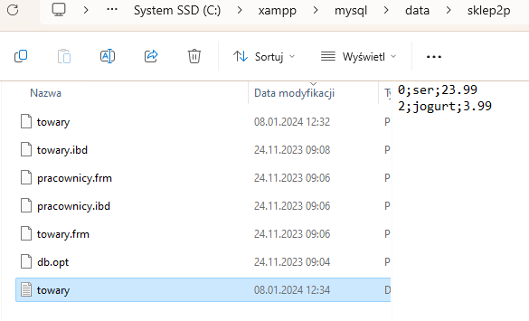

8.  Zaimportuj tabelę z pomocą `LOAD DATA INFILE` *plik* `INTO TABLE`
    *tabela.*  

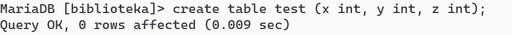
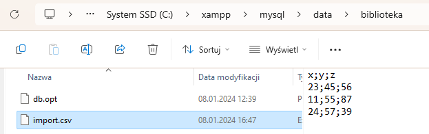
```sql
load data infile 'import.csv' into table test fields terminated by ';';
```
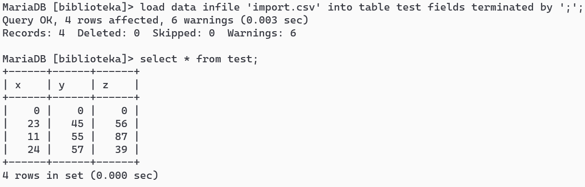

9.  Zaimportuj dane do tabeli za pomocą narzędzia **mysqlimport**.
```sql
mysqlimport -u root -p magazyn dane
Enter password:
magazyn.dane: Records: 1  Deleted: 0  Skipped: 0  Warnings: 0
```
10. Usuń stworzone bazy danych.
11. Zaimportuj dwie bazy XML i JSON.ZIP w _*phpMyAdmin*_.
12. Zaimportuj bazę danych wykonaną w punkcie 4b w shellu z użyciem
    `SOURCE`.

13. Sprawdź poprawność przywrócenia w phpMyAdmin i w shellu.

---

### Ćwiczenia w dniu 27 stycznia 2026r. z klasą 2P grupa 2

14. Utwórz dwóch operatorów kopii zapasowych, którzy mają nadane
    uprawnienia do wykonywania kopii o nazwach **admin** i **admin2**.
    Drugi z operatorów może także przywracać kopie.
15. Utwórz skrypt dla narzędzi mysqldump.exe oraz mariadb-dump, który wykona kopię 4 baz.
    Sprawdź jego działanie.
16. Zmodyfikuj skrypt tak, aby w nazwie pliku kopii pojawiała się data i
    czas utworzenia.
```bash
COLOR 0A
@ECHO OFF

FOR /F "tokens=*" %%i IN ('powershell Get-Date -Format "yyyy-MM-dd_HH-mm"') DO SET data=%%i

ECHO Trwa wykonywanie kopii...
C:\xampp\mysql\bin\mysqldump.exe -u admin -p123 --all-databases > C:\xampp\kopia_%data%.sql

ECHO.
ECHO ==========================================
ECHO Kopia wykonana poprawnie: kopia_%data%.sql
ECHO ==========================================
TIMEOUT /T 60
```

17. Stwórz z pomocą **harmonogramu** i skryptu kopię, zaplanuj jej
    cykliczność co 5 minut ale tylko w dniu ćwiczeń
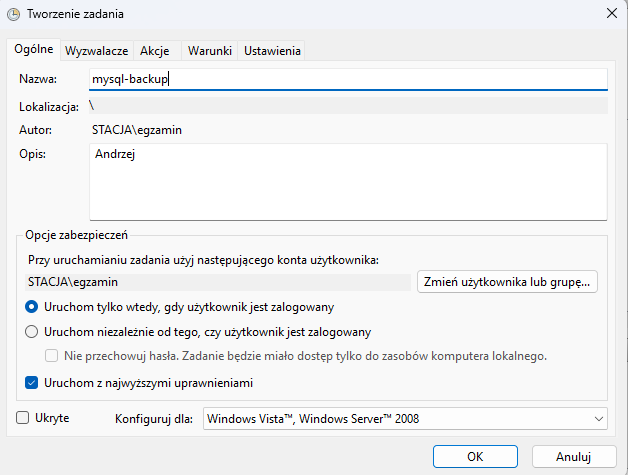
18. Zaczekaj na wykonanie kopii
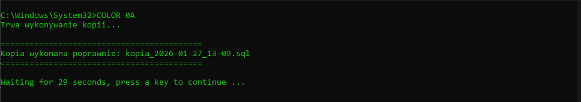
19. Sprawdź poprawność przywrócenia.
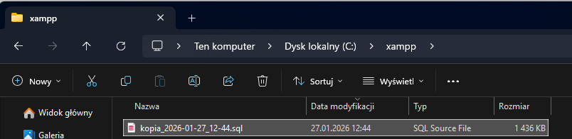

---

19. Stwórz bazę w Microsoft SQL Server Management. Następnie wykonaj jej
    kopię. Usuń bazę, a następnie odtwórz dane z kopii.
20. Utwórz skrypt i z pomocą harmonogramu w Microsoft SQL Server
    Management (tasks-\>Backup-scripts) zaplanuj wykonanie kopii
    zapasowej. W media options ustawić back up to a new media oraz 3
    pozycje w reliability. W backup options ustaw wygasanie za 2
    miesiące z kompresją i szyfrowaniem na AES 256.
21. Sprawdź poprawność przywrócenia.
22. Stwórz bazę w PgAdmin, następnie wykonaj jej kopię. Usuń bazę, a
    następnie odtwórz dane z kopii.
23. Stwórz z pomocą **harmonogramu** i skryptu kopię bazy w postgreSQL,
    zaplanuj jej cykliczność o zadanych godzinach i dniach.
24. Sprawdź poprawność przywrócenia.
25. Na jednym z komputerów udostępnić w systemie linux bazę o nazwie
    hurtownia z jedną tabelą magazyn dla użytkownika operator. Wszyscy
    podłączają się do jednej bazy i wprowadzają po 5 rekordów danych do
    tabeli magazyn.

| Nazwa pola     | Typ danych | Wartość | Klucz       | Inne                                |
 |----------------|------------|---------|-------------|-------------------------------------|
| id             | Int(11)    |         | PRIMARY KEY | AUTO_INCREMENT                      |
| autor          | TEXT       |     NOT NULL    |             NOT NULL |
| cena           | decimal    |                 |       | długość 10 do 2 miejsc po przecinku |
| data_sprzedazy | DATE       |                |          | rrrr-MM-dd                          |
| producent      | VARCHAR    |    NOT NULL    |         | długość 45                           |
26. Na stacji Ubuntu Desktop zainstaluj oprogramowanie bazy danych
    mariadb:

```bash
    sudo apt update
    sudo apt install mariadb-server mariadb-client mc -y
```
27. Ustaw hasło użytkownika root bazy danych:
```bash
    sudo mariadb-secure-installation
```
28. Stwórz bazę danych z jedną tabelą i 3 rekordami danych.
29. Z pomocą mariadb-dump wykonaj kopię bazy w katalogu `~/twoje_imię`.
30. Sprawdź wyświetlanie daty i czasu komendą date
31. Utwórz skrypt, który wykona kopię twojej bazy do pliku `backup.sql`
32. Sprawdź komendę kompresji dla kopii poleceniem tar.
33. Popraw skrypt, tak aby w nazwie pliku kopii znalazła się data i czas
    jej wykonania, a następnie utwórz archiwum tar.bz2.
34. Stwórz z pomocą **CRONTABA** i skryptu kopię, zaplanuj jej
    cykliczność o zadanych godzinach i dniach.
35. Wykonać kopię lokalną bazy hurtownia dla nauczyciela, następnie
    wszyscy wykonują kopię zdalnie i odtwarzają bazę na swoich
    komputerach.
