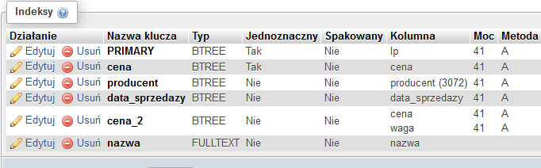

# Ćwiczenia 6 część 1 -- optymalizacja, defragmentacja, indeksy

1. Uruchomić Apache i MySql.

1. Otwórz dokumentację:

   <https://mariadb.com/docs/server/reference/sql-statements/data-definition/create/create-index>

   <https://mariadb.com/docs/server/reference/sql-statements/data-definition/alter/alter-table>

   <https://mariadb.com/docs/server/reference/sql-statements/data-definition/drop/drop-index>

   <https://mariadb.com/docs/server/reference/sql-statements/administrative-sql-statements/show/show-index>

1. Zaimportuj bazę sklep z .

   ```SQL
   CREATE DATABASE IF NOT EXISTS `sklep`
   ```

   ```SQL
   CREATE TABLE `towary` (

    `lp` int(11) NOT NULL,
    `nazwa` varchar(20) NOT NULL,
    `producent` text NOT NULL,
    `data_sprzedazy` date NOT NULL,
    `cena` decimal(10,2) NOT NULL,
    `waga` double(255,2) NOT NULL

   ) ENGINE=InnoDB DEFAULT CHARSET=latin1;
   ```

   ```SQL
   INSERT INTO `towary` (`lp`, `nazwa`, `producent`, `data_sprzedazy`, `cena`, `waga`) VALUES (1, 'chleb', 'Piekarnia 1', '2026-03-19', '12.55', 1.30)

   ```

1. Z pomocą phpMyAdmin (sprawdzaj podgląd SQL):

   

   a)  utwórz indeks prosty dla tabeli towary, kolumna producent (rodzaj
    BTREE )

   b)  utwórz indeks unikatowy dla tabeli towary, kolumna cena (rodzaj HASH
    )

   c)  utwórz indeks dla tabeli towary, kolumna data sprzedaży

   d)  utwórz indeks pełny tekst dla tabeli towary, kolumna nazwa( dodaj
    komentarz )

   e)  utwórz indeks złożony dla tabeli towary, kolumny cena i waga

   f)  utwórz indeks złożony i unikatowy dla tabeli towary, kolumny
    producent i nazwa

   g)  utwórz indeks przestrzenny dla tabeli punkty, kolumna kształt typ
    geometry (wstawić dane do jednego rekordu wsk. ST_GeomFromText... )

   h)  
    

   i)  przejrzyj utworzone indeksy i wykonaj kopię bazy

   j)  usuń wszystkie utworzone indeksy

1. Koniec części 1.
