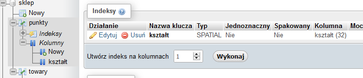
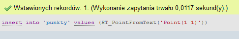

Ćwiczenia 8 -- optymalizacja, defragmentacja, indeksy
1.  Uruchomić Apache i MySql.
2.  Zaimportuj bazę sklep z moodla.
3.  Z pomocą phpMyAdmin (sprawdzaj podgląd SQL):

a)  utwórz indeks prosty dla tabeli towary, kolumna producent (rodzaj
    BTREE )
b)  utwórz indeks unikatowy dla tabeli towary, kolumna cena (rodzaj HASH
    )
c)  utwórz indeks dla tabeli towary, kolumna data sprzedaży
d)  utwórz indeks pełny tekst dla tabeli towary, kolumna nazwa( dodaj
    komentarz )
e)  utwórz indeks złożony dla tabeli towary, kolumny cena i waga
f)  utwórz indeks złożony i unikatowy dla tabeli towary, kolumny
    producent i nazwa
g)  utwórz indeks przestrzenny dla tabeli punkty, kolumna kształt typ
    geometry (wstawić dane do jednego rekordu wsk. ST_GeomFromText... )
h)  
> 
i)  przejrzyj utworzone indeksy i wykonaj kopię bazy
j)  usuń wszystkie utworzone indeksy
<!-- -->
4.  Z pomocą shella i programu mysql:
<!-- -->
a)  Stwórz indeksy, które utworzyłeś w phpMyAdmin dla tabeli towary.
b)  ( np. CREATE INDEX idx_waga ON towary(waga);
c)  lub z sortowaniem CREATE INDEX idx_waga ON towary(waga DESC); )
d)  indeksy złożone ( np. CREATE INDEX idx_NC ON towary(nazwa,cena); )
<!-- -->
5.  Przejrzyj stworzone indeksy.( SHOW INDEX FROM towary;)
6.  Wydaj komendę SHOW CREATE TABLE towary; (aby zobaczyć utworzone
    indeksy.)
7.  Usuń jeden indeks prosty I jeden złożony (np. ALTER TABLE towary
    DROP INDEX idx_NC;)
8.  Wykonaj zapytanie SELECT \* FROM towary WHERE cena=10000;
9.  Podejrzeć, który indeks będzie użyty EXPLAIN SELECT \* FROM towary
    WHERE cena=10000;
10. Wykonaj podpunkty 8,9 dla klauzuli WHERE na pozostałych polach, dla
    których stworzyłeś indeksy.
11. Wydaj komendę SHOW profiles;
12. Wykonaj powyższe polecenia z opcją LIMIT. (np. SELECT \* FROM towary
    WHERE cena=10000 LIMIT 1;)
13. Sprawdź czasy wykonania SHOW profiles;
14. Wykonaj reindeksację tabeli towary.(ANALYZE...
15. Wykonaj defragmentację tabeli towary. ( OPTIMIZE ...
16. Wykonaj sprawdzenie ( CHECK ...
17. Dokonaj naprawy ( REPAIR ...
18. Wykonaj w phpMyAdmin i Shellu operacje dla tabeli towary:

