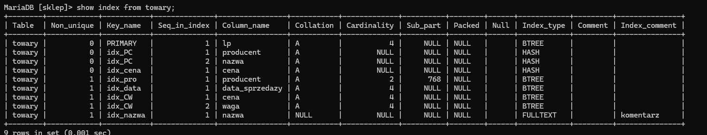
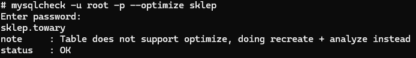
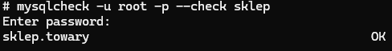
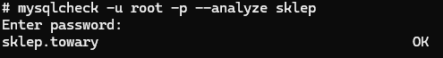
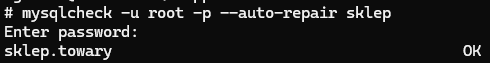

# Ćwiczenia 9 -- optymalizacja, defragmentacja, indeksy

1. Uruchomić Apache i MySql.

1. Otwórz dokumentację:

   <https://mariadb.com/docs/server/reference/sql-statements/data-definition/create/create-index>

   <https://mariadb.com/docs/server/reference/sql-statements/data-definition/alter/alter-table>

   <https://mariadb.com/docs/server/reference/sql-statements/data-definition/drop/drop-index>

   <https://mariadb.com/docs/server/reference/sql-statements/administrative-sql-statements/show/show-index>

1. Zaimportuj bazę sklep z .

   ```SQL
   CREATE DATABASE IF NOT EXISTS `sklep`
   ```

   ```SQL
   CREATE TABLE `towary` (

    `lp` int(11) NOT NULL,
    `nazwa` varchar(20) NOT NULL,
    `producent` text NOT NULL,
    `data_sprzedazy` date NOT NULL,
    `cena` decimal(10,2) NOT NULL,
    `waga` double(255,2) NOT NULL

   ) ENGINE=InnoDB DEFAULT CHARSET=latin1;
   ```

    ```SQL
   ALTER TABLE `towary` ADD PRIMARY KEY (`lp`);
   ```

   ```SQL
   ALTER TABLE `towary` MODIFY `lp` int(11) NOT NULL AUTO_INCREMENT, AUTO_INCREMENT=2;
   ```

   ```SQL
   INSERT INTO `towary` (`lp`, `nazwa`, `producent`, `data_sprzedazy`, `cena`, `waga`) VALUES (1, 'chleb', 'Piekarnia 1', '2026-03-19', '12.55', 1.30)

   ```

1. Z pomocą phpMyAdmin (sprawdzaj podgląd SQL):

   

   a)  utwórz indeks prosty dla tabeli towary, kolumna producent (rodzaj
   BTREE )

   b)  utwórz indeks unikatowy dla tabeli towary, kolumna cena (rodzaj HASH
   )

   c)  utwórz indeks dla tabeli towary, kolumna data sprzedaży

   d)  utwórz indeks pełny tekst dla tabeli towary, kolumna nazwa( dodaj
   komentarz )

   e)  utwórz indeks złożony dla tabeli towary, kolumny cena i waga

   f)  utwórz indeks złożony i unikatowy dla tabeli towary, kolumny
   producent i nazwa

   g)  utwórz indeks przestrzenny dla tabeli punkty, kolumna kształt typ
   geometry (wstawić dane do jednego rekordu wsk. ST_GeomFromText... )

   h)  
   

   i)  przejrzyj utworzone indeksy i wykonaj kopię bazy

   j)  usuń wszystkie utworzone indeksy

1. Koniec części 1.

1. Z pomocą shella i programu mysql lub mariadb:

   a)  Stwórz indeksy, które utworzyłeś w phpMyAdmin dla tabeli towary.

    - indeksy proste, np.:

   ```SQL
   CREATE INDEX idx_waga ON towary(waga);
   ```

    - lub z sortowaniem:

   ```SQL
   CREATE INDEX idx_waga ON towary(waga DESC); )
   ```

   - index z HASH

   ```bash
   create unique index idx_cena using hash on towary(cena);
   ```

   - textfull z komentarzem

   ```bash
   create fulltext index idx_nazwa on towary(nazwa) comment 'komentarz';
   ```

   b)  indeksy złożone, np.:

   ```SQL
   CREATE INDEX idx_NC ON towary(nazwa,cena);
   ```

1. Przejrzyj stworzone indeksy:

   ```SQL
   SHOW INDEX FROM towary;
   ```

   

1. Aby zobaczyć stworzone indeksy wydaj komendę:

   ```SQL
   SHOW CREATE TABLE towary; 
   ```

1. Usuń jeden indeks prosty i jeden złożony, np.:

   ```SQL
   ALTER TABLE towary DROP INDEX idx_NC;
   ```

1. Usuwanie indexu komendą DROP

   ```bash
   drop index idx_cena on towary;
   ```

1. Wykonaj zapytanie:

   ```SQL
   SELECT * FROM towary WHERE cena=10000;
   ```

1. Podejrzeć, który indeks będzie użyty:

   ```SQL
   EXPLAIN SELECT * FROM towary WHERE cena=10000;
   ```

1. Wykonaj podpunkty 8,9 dla klauzuli `WHERE` na pozostałych polach, dla
   których stworzyłeś indeksy.

1. Wydaj komendę:

   ```SQL
   SET profiling = 1;
   SHOW profiles;
   ```

1. Wykonaj powyższe polecenia z opcją LIMIT, np.:

   ```SQL
   SELECT * FROM towary WHERE cena=10000 LIMIT 1;
   ```

1. Sprawdź czasy wykonania:

   ```SQL
   SHOW profiles;
   ```

1. Koniec części 2.

1. Otwórz dokumentację:

   <https://mariadb.com/docs/server/reference/sql-statements/table-statements/repair-table>

   <https://mariadb.com/docs/server/ha-and-performance/optimization-and-tuning/optimizing-tables/optimize-table>

   <https://mariadb.com/docs/server/reference/sql-statements/table-statements/analyze-table>

1. Wykonaj reindeksację tabeli towary, np.:

   ```SQL
   ANALYZE TABLE `towary`;
   ```

1. Wykonaj defragmentację tabeli towary, np.:

   ```SQL
   OPTIMIZE TABLE `towary`;
   ```

1. Wykonaj sprawdzenie spójności. Służy do weryfikacji,
   czy struktura tabeli i jej dane nie uległy uszkodzeniu, np.:

   ```SQL
   CHECK TABLE `towary`;
   ```

1. Dokonaj naprawy, np.:

   ```SQL
   REPAIR TABLE `towary`;
   ```

   Rekomendowana metoda dla InnoDB (przebudowa tabeli):

   ```SQL
   ALTER TABLE `towary` ENGINE='InnoDB';
   ```

1. Wykonaj w phpMyAdmin, zaznacz tabelę -> zakładka operacje i Shellu operacje dla tabeli towary:

   

1. Koniec części 3.

1. Z pomocą programu mysqlcheck wykonaj dla tabeli towary w bazie
    sklep: analizę, sprawdzenie, optymalizację i naprawę.

   --optimize,

   

   --check,

   

   --analyze,

   

   --auto-repair

   

   ```bash
   mariadb-check -u root -p --analyze --optimize --check --auto-repair nazwa_bazy_danych
   ```

   

1. Wykonaj sprawdzenie i autonaprawę:

   ```bash
   mariadb-check -u root -p --check --auto-repair nazwa_bazy_danych
   ```

1. Wykonaj autonaprawę wszystkich baz połączoną z optymalizacją, np.:

    --auto-repair ...--optimize

1. Wykonaj kopię zapasową narzędziem mariadb-dump.

   ```bash
   mariadb-dump -u admin -phaslo nazwa_bazy > kopia.sql 
   ```

1. Usuń stworzone indeksy:

   ```SQL
   DROP INDEX 
   ```

1. Dodatkowo napisz skrypt w JS, który utworzy bazę o nazwie dane z jedną
    tabelą o nazwie punkty zawierającą współrzędne punktów w przestrzeni
    ( czyli 3 kolumny X,Y,Z).

   ```SQL
   CREATE TABLE IF NOT EXISTS punkty(x INT, y INT, z INT);
   ```

   Ilość rekordów 1 mln., fragment początkowy skryptu:

   ```bash
   const { randomInt } = require('crypto');

    const mysql = require('mysql');

    var con = mysql.createConnection({
        host: "localhost",
        user: "twoje_konto",
        password: "*********** twoje hasło ****************",
        database: "dane"
    });

      con.connect(function(err) {
        if (err) throw err;

        console.log("Połączono z bazą danych.");

    con.query("CREATE TABLE IF NOT EXISTS punkty(x INT, y INT, z INT);", function(err, result) {
        if (err) throw err;
        
        const total = 1000000;
        const batchSize = 10000; // Wstawiamy po 10k rekordów na raz
        let inserted = 0;

        function insertBatch() {
            if (inserted >= total) {
                console.log("Gotowe!");
                con.end();
                return;
            }

            let values = [];
            for (let i = 0; i < batchSize; i++) {
                values.push([randomInt(100), randomInt(100), randomInt(100)]);
            }

            con.query("INSERT INTO punkty (x, y, z) VALUES ?", [values], function(err) {
                if (err) throw err;
                inserted += batchSize;
                console.log(`Postęp: ${inserted}/${total}`);
                insertBatch();
            });
        }

        insertBatch();

    }); // Koniec callbacku dla CREATE TABLE
    }); // Koniec callbacku dla con.connect()
   ```

1. Przetestuj indeksy na tej bazie na 1,2 i 3 kolumnach.
   Wybieramy konkretne wartości (np. x=5, y=10, z=15), które na pewno istnieją lub są prawdopodobne.

   - Test bez indeksu

   ```SQL
   -- Włączamy mierzenie czasu w konsoli MariaDB
   SET profiling = 1;

   SELECT * FROM punkty WHERE x = 5 AND y = 10 AND z = 15;

   SHOW PROFILE;
   ```

   ```sql
   EXPLAIN SELECT *FROM punkty WHERE x = 10 AND y = 20 AND z = 30;
   ```

    ```text
        Enter password:

    +------+-------------+--------+------+---------------+------+---------+------+--------+-------------+
    | id   | select_type | table  | type | possible_keys | key  | key_len | ref  | rows   | Extra       |
    +------+-------------+--------+------+---------------+------+---------+------+--------+-------------+
    |    1 | SIMPLE      | punkty | ALL  | NULL          | NULL | NULL    | NULL | 997920 | Using where |
    +------+-------------+--------+------+---------------+------+---------+------+--------+-------------+
    ```

    type: ALL, co oznacza pełne skanowanie ~ miliona wierszy

- Test z indeksem na 1 kolumnie (X)

   ```SQL
   CREATE INDEX idx_x ON punkty(x);

   SELECT * FROM punkty WHERE x = 5 AND y = 10 AND z = 15;

   SHOW PROFILE;
   ```

   ```text
      Enter password:

    +------+------+------+
    | x    | y    | z    |
    +------+------+------+
    |    5 |   10 |   15 |
    +------+------+------+
    +------------------------+----------+
    | Status                 | Duration |
    +------------------------+----------+
    | Starting               | 0.000028 |
    | checking permissions   | 0.000003 |
    | Opening tables         | 0.000011 |
    | After opening tables   | 0.000006 |
    | System lock            | 0.000003 |
    | table lock             | 0.000004 |
    | init                   | 0.000020 |
    | Optimizing             | 0.000014 |
    | Statistics             | 0.000044 |
    | Preparing              | 0.000019 |
    | Executing              | 0.000002 |
    | Sending data           | 0.011711 |
    | End of update loop     | 0.000004 |
    | Query end              | 0.000002 |
    | Commit                 | 0.000002 |
    | Query end              | 0.000002 |
    | closing tables         | 0.000002 |
    | Unlocking tables       | 0.000001 |
    | closing tables         | 0.000003 |
    | Query end              | 0.000003 |
    | Starting cleanup       | 0.000001 |
    | Freeing items          | 0.000004 |
    | Updating status        | 0.000007 |
    | Reset for next command | 0.000002 |
    +------------------------+----------+

   ```

    **Sprawdzamy Sending data: 0.011711**

   ```sql
   EXPLAIN SELECT *FROM punkty WHERE x = 10 AND y = 20 AND z = 30;
   ```

   ```text
   +------+-------------+--------+------+---------------+-------+---------+-------+-------+-------------+
   | id   | select_type | table  | type | possible_keys | key   | key_len | ref   | rows  | Extra       |
   +------+-------------+--------+------+---------------+-------+---------+-------+-------+-------------+
   |    1 | SIMPLE      | punkty | ref  | idx_x         | idx_x | 5       | const | 19742 | Using where |
   +------+-------------+--------+------+---------------+-------+---------+-------+-------+-------------+
   ```

   ```sql
   DROP INDEX idx_x ON punkty;
   ```

- Test z indeksem na 2 kolumnach (X, Y)

   ```SQL
   CREATE INDEX idx_xy ON punkty(x, y);

   SELECT * FROM punkty WHERE x = 5 AND y = 10 AND z = 15;

   SHOW PROFILE;
   ```

   ```text
      Enter password:

    +------+------+------+
    | x    | y    | z    |
    +------+------+------+
    |    5 |   10 |   15 |
    +------+------+------+
    +------------------------+----------+
    | Status                 | Duration |
    +------------------------+----------+
    | Starting               | 0.000023 |
    | checking permissions   | 0.000003 |
    | Opening tables         | 0.000118 |
    | After opening tables   | 0.000003 |
    | System lock            | 0.000003 |
    | table lock             | 0.000004 |
    | Opening tables         | 0.000008 |
    | After opening tables   | 0.000003 |
    | System lock            | 0.000002 |
    | table lock             | 0.000013 |
    | Unlocking tables       | 0.000003 |
    | closing tables         | 0.000006 |
    | init                   | 0.000018 |
    | Optimizing             | 0.000014 |
    | Statistics             | 0.000036 |
    | Preparing              | 0.000017 |
    | Executing              | 0.000002 |
    | Sending data           | 0.000323 |
    | End of update loop     | 0.000004 |
    | Query end              | 0.000002 |
    | Commit                 | 0.000002 |
    | Query end              | 0.000002 |
    | closing tables         | 0.000002 |
    | Unlocking tables       | 0.000001 |
    | closing tables         | 0.000002 |
    | Query end              | 0.000002 |
    | Starting cleanup       | 0.000001 |
    | Freeing items          | 0.000003 |
    | Updating status        | 0.000006 |
    | Reset for next command | 0.000002 |
    +------------------------+----------+

   ```

    ```sql
    EXPLAIN SELECT *FROM punkty WHERE x = 10 AND y = 20 AND z = 30;"
    ```

    ```text

    Enter password:
    +------+-------------+--------+------+---------------+--------+---------+-------------+------+-------------+
    | id   | select_type | table  | type | possible_keys | key    | key_len | ref         | rows | Extra       |
    +------+-------------+--------+------+---------------+--------+---------+-------------+------+-------------+
    |    1 | SIMPLE      | punkty | ref  | idx_xy        | idx_xy | 10      | const,const | 91   | Using where |
    +------+-------------+--------+------+---------------+--------+---------+-------------+------+-------------+
    ```

    ```sql
    DROP INDEX idx_xy ON punkty;
    ```

- Test z indeksem na 3 kolumnach (X, Y, Z)

   ```SQL
   CREATE INDEX idx_xyz ON punkty(x, y, z);

   SELECT * FROM punkty WHERE x = 5 AND y = 10 AND z = 15;

   SHOW PROFILE;
   ```

    ```text

    Enter password:
    +------+------+------+
    | x    | y    | z    |
    +------+------+------+
    |    5 |   10 |   15 |
    +------+------+------+
    +------------------------+----------+
    | Status                 | Duration |
    +------------------------+----------+
    | Starting               | 0.000029 |
    | checking permissions   | 0.000003 |
    | Opening tables         | 0.000129 |
    | After opening tables   | 0.000004 |
    | System lock            | 0.000003 |
    | table lock             | 0.000004 |
    | Opening tables         | 0.000008 |
    | After opening tables   | 0.000002 |
    | System lock            | 0.000002 |
    | table lock             | 0.000013 |
    | Unlocking tables       | 0.000003 |
    | closing tables         | 0.000006 |
    | init                   | 0.000019 |
    | Optimizing             | 0.000014 |
    | Statistics             | 0.000057 |
    | Preparing              | 0.000039 |
    | Executing              | 0.000002 |
    | Sending data           | 0.000020 |
    | End of update loop     | 0.000003 |
    | Query end              | 0.000002 |
    | Commit                 | 0.000003 |
    | Query end              | 0.000002 |
    | closing tables         | 0.000002 |
    | Unlocking tables       | 0.000002 |
    | closing tables         | 0.000002 |
    | Query end              | 0.000002 |
    | Starting cleanup       | 0.000002 |
    | Freeing items          | 0.000004 |
    | Updating status        | 0.000008 |
    | Reset for next command | 0.000002 |
    +------------------------+----------+

    ```

    **Sending data : 0.000020**

    ```sql
    EXPLAIN SELECT *FROM punkty WHERE x = 10 AND y = 20 AND z = 30;"
    ```

    ```text
        Enter password:

    +------+-------------+--------+------+---------------+---------+---------+-------------------+------+-------------+
    | id   | select_type | table  | type | possible_keys | key     | key_len | ref               | rows | Extra       |
    +------+-------------+--------+------+---------------+---------+---------+-------------------+------+-------------+
    |    1 | SIMPLE      | punkty | ref  | idx_xyz       | idx_xyz | 15      | const,const,const | 4    | Using index |
    +------+-------------+--------+------+---------------+---------+---------+-------------------+------+-------------+
    ```

    Sprawdzenie rozmiaru danych i indeksów:

     ```sql
      SELECT
          table_name AS 'Tabela',
          ROUND(data_length / 1024 / 1024, 2) AS 'Dane (MB)',
          ROUND(index_length / 1024 / 1024, 2) AS 'Indeksy (MB)'
      FROM information_schema.TABLES
      WHERE table_schema = 'dane';"
      ```

      ```text
      Enter password:
      +--------+-----------+--------------+
      | Tabela | Dane (MB) | Indeksy (MB) |
      +--------+-----------+--------------+
      | punkty |     38.58 |       69.31 |
      +--------+-----------+--------------+
      ```

    ```sql
    DROP INDEX idx_xyz ON punkty;
    ```

1. Porównaj wyniki.

   | Typ Testu | Co robi MariaDB? | Przewidywany Czas |
   |:-----------:|:-------------------|:--------------------:|
   | Brak indeksu | Przegląda każdy z 1 000 000 wierszy po kolei. |  ~250 ms|
   | Indeks (X) | Wybiera np. 1000 wierszy gdzie X=5, a potem ręcznie sprawdza w nich Y i Z. | ~5-20 ms |
   | Indeks (X, Y, Z) | Idzie prosto do celu | < 1 ms |

1. KONIEC.🔚
