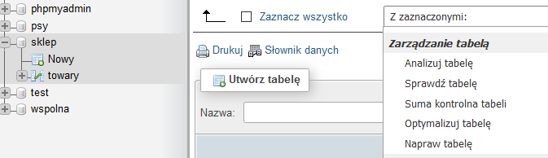
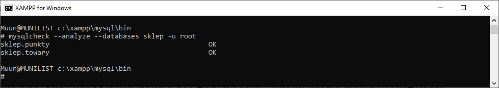

# Ćwiczenia 9 -- optymalizacja, defragmentacja, indeksy

1. Uruchomić Apache i MySql.

1. Otwórz dokumentację:

   <https://mariadb.com/docs/server/reference/sql-statements/data-definition/create/create-index>

   <https://mariadb.com/docs/server/reference/sql-statements/data-definition/alter/alter-table>

   <https://mariadb.com/docs/server/reference/sql-statements/data-definition/drop/drop-index>

   <https://mariadb.com/docs/server/reference/sql-statements/administrative-sql-statements/show/show-index>

1. Zaimportuj bazę sklep z .

   ```SQL
   CREATE DATABASE IF NOT EXISTS `sklep`
   ```

   ```SQL
   CREATE TABLE `towary` (

    `lp` int(11) NOT NULL,
    `nazwa` varchar(20) NOT NULL,
    `producent` text NOT NULL,
    `data_sprzedazy` date NOT NULL,
    `cena` decimal(10,2) NOT NULL,
    `waga` double(255,2) NOT NULL

   ) ENGINE=InnoDB DEFAULT CHARSET=latin1;
   ```

   ```SQL
   INSERT INTO `towary` (`lp`, `nazwa`, `producent`, `data_sprzedazy`, `cena`, `waga`) VALUES (1, 'chleb', 'Piekarnia 1', '2026-03-19', '12.55', 1.30)

   ```

1. Z pomocą phpMyAdmin (sprawdzaj podgląd SQL):

   

   a)  utwórz indeks prosty dla tabeli towary, kolumna producent (rodzaj
   BTREE )

   b)  utwórz indeks unikatowy dla tabeli towary, kolumna cena (rodzaj HASH
   )

   c)  utwórz indeks dla tabeli towary, kolumna data sprzedaży

   d)  utwórz indeks pełny tekst dla tabeli towary, kolumna nazwa( dodaj
   komentarz )

   e)  utwórz indeks złożony dla tabeli towary, kolumny cena i waga

   f)  utwórz indeks złożony i unikatowy dla tabeli towary, kolumny
   producent i nazwa

   g)  utwórz indeks przestrzenny dla tabeli punkty, kolumna kształt typ
   geometry (wstawić dane do jednego rekordu wsk. ST_GeomFromText... )

   h)  
   

   i)  przejrzyj utworzone indeksy i wykonaj kopię bazy

   j)  usuń wszystkie utworzone indeksy

1. Koniec części 1.

1. Z pomocą shella i programu mysql lub mariadb:

   a)  Stwórz indeksy, które utworzyłeś w phpMyAdmin dla tabeli towary.

    - indeksy proste, np.:

   ```SQL
   CREATE INDEX idx_waga ON towary(waga);
   ```

    - lub z sortowaniem:

   ```SQL
   CREATE INDEX idx_waga ON towary(waga DESC); )
   ```

   b)  indeksy złożone, np.:

   ```SQL
   CREATE INDEX idx_NC ON towary(nazwa,cena);
   ```

1. Przejrzyj stworzone indeksy:

   ```SQL
   SHOW INDEX FROM towary;
   ```

1. Aby zobaczyć stworzone indeksy wydaj komendę:

   ```SQL
   SHOW CREATE TABLE towary; 
   ```

1. Usuń jeden indeks prosty i jeden złożony, np.:

   ```SQL
   ALTER TABLE towary DROP INDEX idx_NC;
   ```

1. Wykonaj zapytanie:

   ```SQL
   SELECT * FROM towary WHERE cena=10000;
   ```

1. Podejrzeć, który indeks będzie użyty:

   ```SQL
   EXPLAIN SELECT * FROM towary WHERE cena=10000;
   ```

1. Wykonaj podpunkty 8,9 dla klauzuli `WHERE` na pozostałych polach, dla
   których stworzyłeś indeksy.

1. Wydaj komendę:

   ```SQL
   SHOW profiles;
   ```

1. Wykonaj powyższe polecenia z opcją LIMIT, np.:

   ```SQL
   SELECT * FROM towary WHERE cena=10000 LIMIT 1;
   ```

1. Sprawdź czasy wykonania:

   ```SQL
   SHOW profiles;
   ```

1. Koniec części 2.

1. Otwórz dokumentację:

   <https://mariadb.com/docs/server/reference/sql-statements/table-statements/repair-table>

   <https://mariadb.com/docs/server/ha-and-performance/optimization-and-tuning/optimizing-tables/optimize-table>

   <https://mariadb.com/docs/server/reference/sql-statements/table-statements/analyze-table>

1. Wykonaj reindeksację tabeli towary, np.:

   ```SQL
   ANALYZE TABLE `towary`;
   ```

1. Wykonaj defragmentację tabeli towary, np.:

   ```SQL
   OPTIMIZE TABLE `towary`;
   ```

1. Wykonaj sprawdzenie spójności. Służy do weryfikacji,
   czy struktura tabeli i jej dane nie uległy uszkodzeniu, np.:

   ```SQL
   CHECK TABLE `towary`;
   ```

1. Dokonaj naprawy, np.:

   ```SQL
   REPAIR ...
   ```

1. Wykonaj w phpMyAdmin i Shellu operacje dla tabeli towary:

   

1. Koniec części 3.

19. Z pomocą programu mysqlcheck wykonaj dla tabeli towary w bazie
    sklep: analizę, sprawdzenie, optymalizację i naprawę. ( \--optimize,
    \--check, \--analyze, \--repair)

20. Wykonaj autonaprawę wszystkich baz połączoną z optymalizacją.(
    \--auto-repair ...\--optimize
21. Wykonaj kopię zapasową.
22. Usuń stworzone indeksy. ( DROP INDEX ...
23. Dodatkowo napisz skrypt, który utworzy bazę o nazwie dane z jedną
    tabelą o nazwie punkty zawierającą współrzędne punktów w przestrzeni
    ( czyli 3 kolumny X,Y,Z). Ilość rekordów 1 mln.
24. Przetestuj indeksy na tej bazie na 1,2 i 3 kolumnach. Porównaj
    wyniki.
